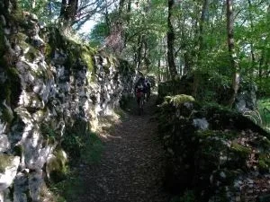
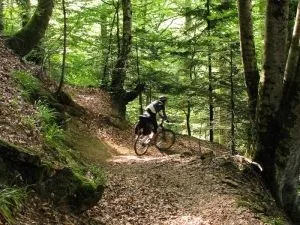
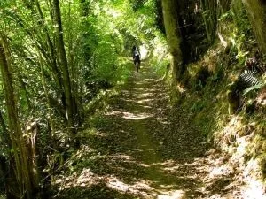
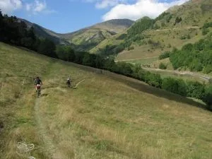
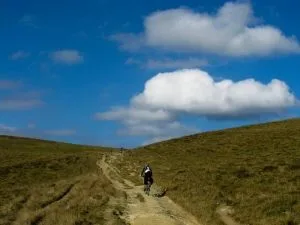
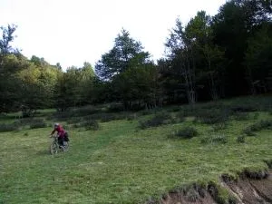

Hola globeros!
Los 4 últimos días de septiembre, sqlp estuvo haciendo la Pedals d'Occitania (Bueno, una pequeña variante, debido a la falta de tiempo). Salida y llegada a Bossost, en lugar de Vielha, para reducir en unos 50km los 220km totales.

Ha sido toda una revelación, la mayoría del recorrido es sobre senderos ciclables (Con bolsa de manillar y transportín) a través de frondosos bosques de hayas, abetos, avellanos, castaños,...

Aqui podéis ver algunas fotos:

Enhorabuena a Sara, Eva y Ricardo, que se estrenaban en esto de las rutas btt de varios días y cumplieron a la perfección.

Seguimos el roadbook que encontramos en <a href="http://www.megaupload.com/es/?d=50JLHW2U">este enlace</a> de la red. También es fácil encontrar el track para gps, si lo prefieres...

Sin duda sqlp volverá a la mínima oportunidad para realizar la ruta completa, porque merece la pena!

Happy trails!!!

AlbertoEpic.

