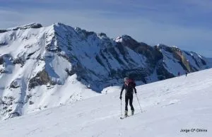

El pasado día 22, y por la gloria de Brad Pitt (y también un poco por la de San Vicente), un pequeño grupo de globeros se apuntó a la indecente proposición de Jorge: ascensión al pico Barrosa, en ruta circular. Ida por el circo de Pinarra y vuelta por el circo de Barrosa.

Todo un éxito de jornada, con buena meteo en este invierno de borrascas exprés... Próximamente podrás ver el video de Producciones Soloquedalopeor. Para ir abriendo boca, aqui tienes la <a href="http://blancavizcaino.blogspot.com/2010/01/toc-toc-barrosa.html" target="_blank">crónica de Blanca</a> y las <a href="http://picasaweb.google.es/jorgegdihinx/BARROSACircular22Ene2010#" target="_blank">fotos de Jorge</a>.

<b>...:::ACTUALIZACIÓN 28 de enero:::...</b>
Por fin está listo el video de la actividad:

https://blip.tv/play/hM9ygcGDawA
</embed>

