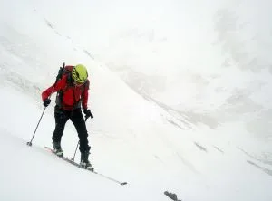
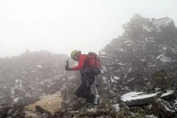

<table cellpadding="0" cellspacing="0" style="float: right; text-align: right;"><tbody><tr><td style="text-align: center;"></td></tr><tr><td style="text-align: center;">En la pala final. Abajo, al fondo, el collado de la Soba.</td></tr></tbody></table>El pasado domingo, Luzia y AlbertoEpic marchamos al pico Arriel por el valle d'Arrious.

A mitad de subida nos pillaron Teo y Miguel. El cielo encapotado y amenazante dejó de amenazar, y se puso a nevar. En el collado de la Soba, entre la nevada y la niebla pudimos ver que el resto del camino al Arriel estaba sin nieve. Sobre la marcha, y por no bajarnos sin cima, optamos por subir al pico del Cuello de Soba (Punta dero Cuello), que conservaba una buena pala con nieve.

La primera mitad del descenso, con nieve polvo... pero sin visibilidad! Y la segunda mitad, por suerte, ya salimos de la niebla y gozamos de una gran visibilidad... bajo la lluvia!

Es curioso, pero con la temporadita que llevamos, a pesar de la meteo, este fue considerado un gran día: cima, esquiada de más de 1.000m de desnivel, un buen rato de nieve polvo, sin placas de hielo, porteo de 5min. desde el coche a la nieve...

<table align="center" cellpadding="0" cellspacing="0" style="margin-left: auto; margin-right: auto; text-align: center;"><tbody><tr><td style="text-align: center;"></td></tr><tr><td style="text-align: center;">Últimos metros a la cima, en plena nevada.</td></tr></tbody></table>Puedes descargarte el track de esta ascensión en <a href="http://notepierdas.soloquedalopeor.com/ruta.php?id=59" target="_blank">No Te Pierdas...</a>

