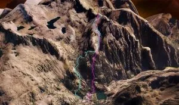

El pasado domingo tuvo lugar una jornada de hermanamiento entre tribus blogeras. Se dieron cita en el Balneario de Panticosa representantes de <a href="http://senderolimite.blogspot.com/" target="_blank">Sendero Límite</a>, <a href="http://lasfocasmajaras.blogspot.com/" target="_blank">Las Focas Majaras</a>, <a href="http://caracolesmajaras.blogspot.com/" target="_blank">Los Caracoles Majaras</a> y <a href="https://soloquedalopeor.com/">Soloquedalopeor</a>. Cabe destacar que algunos de los presentes ocupan altos cargos en varias de esas tribus.

El objetivo fueron los Foratulas I y II, terrenos pertenecientes al condado de Sendero Límite. Agradecimientos a Julio y a Luis, marqueses de Foratulas, que nos guiaron a través de un original itinerario por los recovecos de sus dominios.

La jornada de confraternización resultó todo un éxito. Ya estamos esperando la siguiente...

Puedes ver más información del evento en los demás blogs:

- <a href="http://senderolimite.blogspot.com/" target="_blank">Video</a> y <a href="http://senderolimite.blogspot.com/2010/01/la-fiesta-del-foratulas.html" target="_blank">crónica</a> en Sendero Límite.

- <a href="http://lasfocasmajaras.blogspot.com/2010/01/fiesta-blogera-en-el-foratulas.html" target="_blank">Crónica</a> en Las Focas Majaras.

A continuación puedes ver el recorrido de ascenso/descenso seguido por el grupo hacia el Foratulas I.

