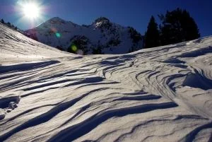
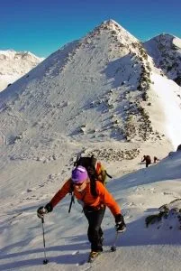
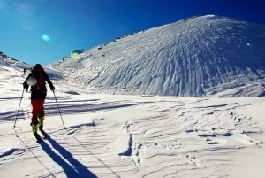

El pasado domingo, un variado grupo de peculiares seres se dieron cita en el Balneario de Panticosa para pasar la mañana foqueando. Al final, debido al riesgo de aludes y a la influencia del video visto en el blog <a href="http://senderolimite.blogspot.com/2010/01/ensenando-el-foratulas-que-nunca.html">Sendero Límite</a> (Saludos a Luis y a Julio), se decide ir al pico Foratulas. Lástima que en lugar del polvorón que sale en el video de S.L., nos encontramos una pala final totalmente helada...
Acompañan el post unas fotos de Morenetti.

<b>ACTUALIZACIÓN:</b> No tengo tiempo para más. En <a href="https://blip.tv/file/3078378" target="_blank">este enlace</a> puedes ver el video de la actividad, que necesitaría más tiempo de postproducción para pasar el standard de calidad de sqlp. Otra gran edición de Lucía...

Y <a href="http://lasfocasmajaras.blogspot.com/2010/01/punta-foratula.html" target="_blank">haciendo click aquí</a> puedes leer la mítica crónica de jR en las Focas Majaras.

