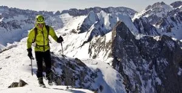

<table align="center" cellpadding="0" cellspacing="0" style="margin-left: auto; margin-right: auto; text-align: center;"><tbody><tr><td style="text-align: center;"></td></tr><tr><td style="text-align: center;">Últimos pasos a la cima del Lariste (2.168m) -- Foto de Rafa Moreno</td></tr></tbody></table>No pensaba reseñar esta actividad, pero la fotaza que me sacó Rafa llegando a la cima creo que lo merece... El pasado domingo, desafiando a los modelos meteorológicos de la gente del tiempo que anunciaban vientos huracanados, temperaturas heladoras y una nueva glaciación, nos fuimos al monte Rafa, Inazio, Luzia y AlbertoEpic. El destino (bueno, y la poca nieve, y alguna otra nimiedad...), hizo que nos encontráramos con Miguel y David, casualmente con el mismo objetivo.

Nos fuimos todos a Oza, hasta donde la nieve obligó a dejar los coches, y desde allí hasta la cima del pico Lariste. Puedes ver y descargarte el track en <a href="http://notepierdas.soloquedalopeor.com/ruta.php?id=44" target="_blank">No Te Pierdas</a>.

Debemos agradecer desde aqui a Jorge (<a href="http://www.lameteoqueviene.blogspot.com/" target="_blank">La Meteo Que Viene</a>) por tan buena sugerencia. En épocas de escasez de nieve, encontrar una ruta así, con esquís puestos desde el coche y con una esquiada decente, sin las malditas placas de hielo, es una suerte.

