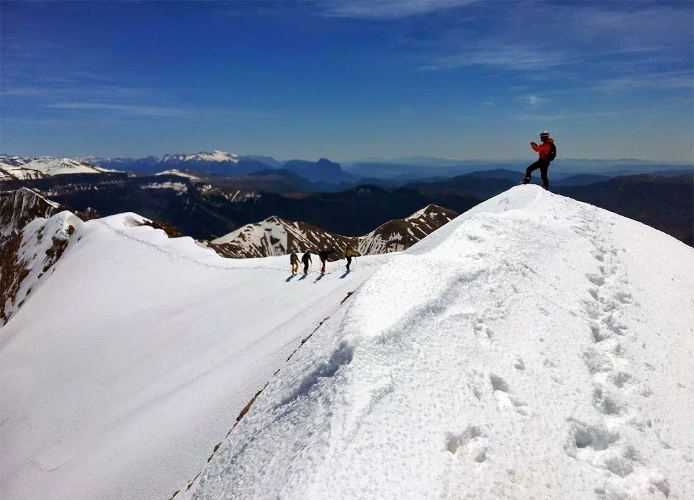
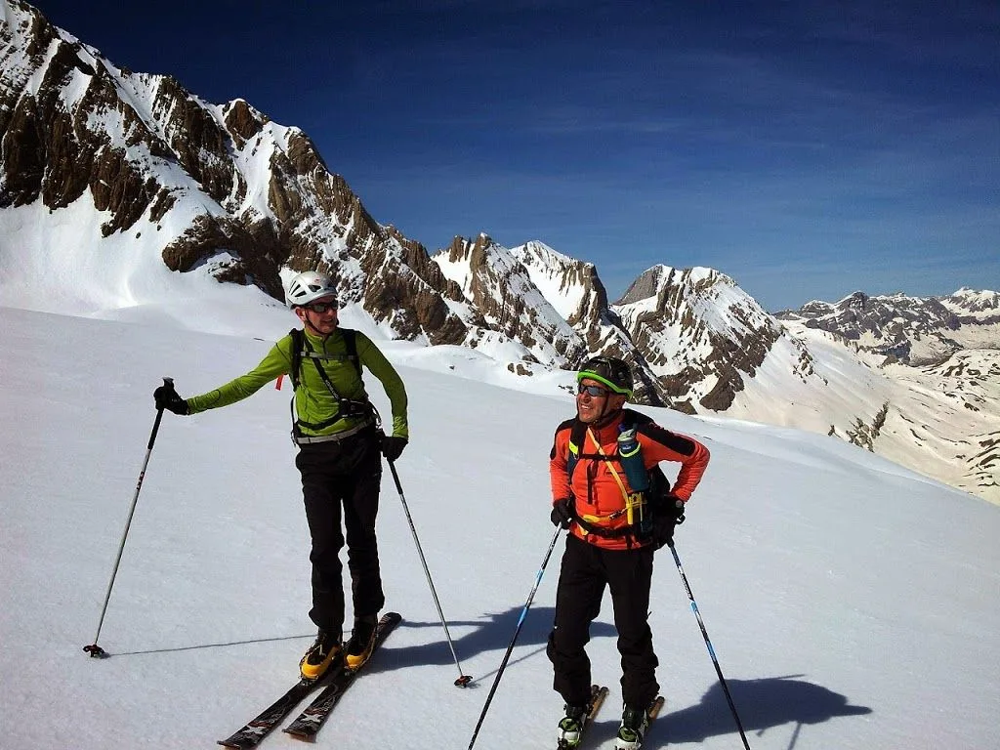
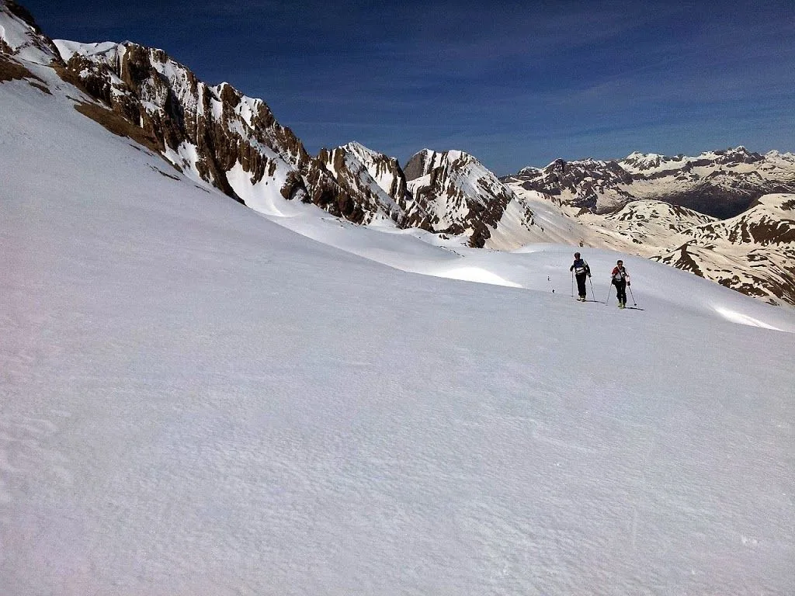
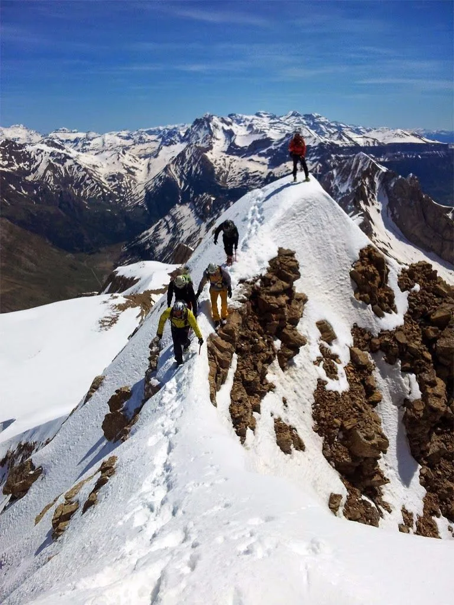
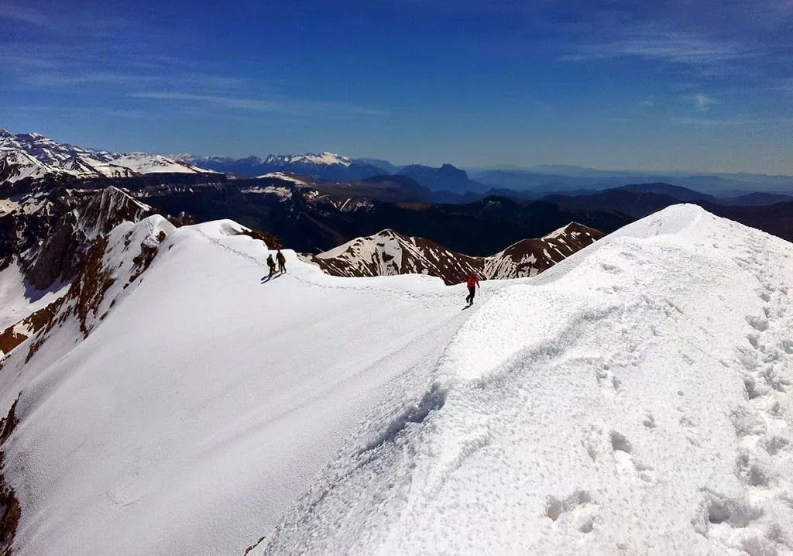
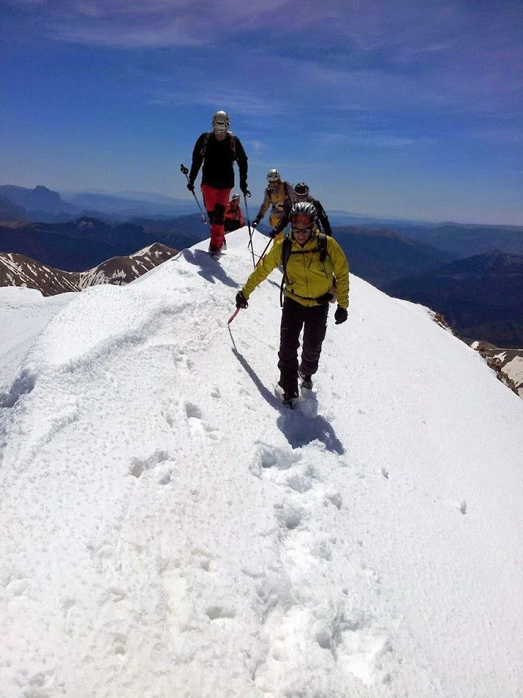

<table cellpadding="0" cellspacing="0" style="float: right; margin-left: 1em; text-align: right;"><tbody><tr><td style="text-align: center;"></td></tr><tr><td style="text-align: center;">Jorge filmando al grupo en la arista cimera</td></tr></tbody></table>El pasado domingo se alinearon los astros, y produjeron una serie de coincidencias irrepetibles en la temporada que no se podían dejar pasar: Pista de la Ripera limpia de nieve, hueco en un 4x4, llaves de la cadena de la pista, condiciones excepcionales de nieve a escasos minutos de la pista, buena meteo...

Una situación así no se podía dejar pasar. Quedada en Panticosa, completado de los todoterrenos y subida al Rincón del Verde por la pista de La Ripera (Luis -<a href="http://senderolimite.blogspot.com.es/" target="_blank">Sendero Límite</a>- continúa alargando la sombra de su leyenda y sube corriendo desde Panticosa).

Desde allí, subida al pico Tendeñera con unas condiciones de nieve, tanto para la subida como para la bajada, de esas que te hacen pensar '¿para qué narices quiero yo nieve polvo, si la primavera es genial?'

<table align="center" cellpadding="0" cellspacing="0" style="margin-left: auto; margin-right: auto; text-align: center;"><tbody><tr><td style="text-align: center;"></td></tr><tr><td style="text-align: center;">Alfredo y Jesús, en la subida </td></tr></tbody></table><table align="center" cellpadding="0" cellspacing="0" style="margin-left: auto; margin-right: auto; text-align: center;"><tbody><tr><td style="text-align: center;"></td></tr><tr><td style="text-align: center;">'Fantabulosas' laderas para el descenso...</td></tr></tbody></table><table align="center" cellpadding="0" cellspacing="0" style="margin-left: auto; margin-right: auto; text-align: center;"><tbody><tr><td style="text-align: center;"></td></tr><tr><td style="text-align: center;">En el paso clave de la arista cimera</td></tr></tbody></table>

<table align="center" cellpadding="0" cellspacing="0" style="margin-left: auto; margin-right: auto; text-align: center;"><tbody><tr><td style="text-align: center;"></td></tr><tr><td style="text-align: center;">Parte final de la arista cimera</td></tr></tbody></table><table align="center" cellpadding="0" cellspacing="0" style="margin-left: auto; margin-right: auto; text-align: center;"><tbody><tr><td style="text-align: center;"></td></tr><tr><td style="text-align: center;">Llegada a la cima</td></tr></tbody></table>

Y a continuación, el vídeo de Jorge (<a href="http://lameteoqueviene.blogspot.com.es/" target="_blank">La Meteo Que Viene</a>):

<iframe allowfullscreen="" frameborder="0" height="370" src="https://www.youtube.com/embed/9FaWVW2WzjU" width="657"></iframe>

