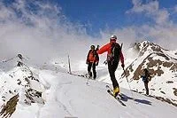

El último fin de semana de abril, en SQLP retomamos los cacharros de nieve y nos vamos al Balneario de Panticosa, a apurar la nieve antes de que haya que portear demasiado para llegar a ella. Como, ya que nos ponemos, nos ponemos bien, tocará una ruta de algo más de 2.000m de desnivel+ acumulado.

Últimamente voy muy escaso de tiempo libre y no tengo tiempo de editar vídeos, así que tomo prestado de Jorge (La Meteo Que Viene) su videoreportaje para ilustrar la actividad. Gracias, Jorge!

<iframe allowfullscreen="" frameborder="0" height="370" src="https://www.youtube.com/embed/Kn2d8aIUpu0" width="657"></iframe> 

Para lo que sí que tuve tiempo fue para encender el gps y grabar el track de la ruta. A continuación puedes ver el Google Earth Tour:

<iframe frameborder="0" height="400" marginheight="0" marginwidth="0" scrolling="no" src="http://www.gpsies.com/mapOnly.do?fileId=seeqghopaakliwaa&mode=kmlTour" width="600"></iframe>

