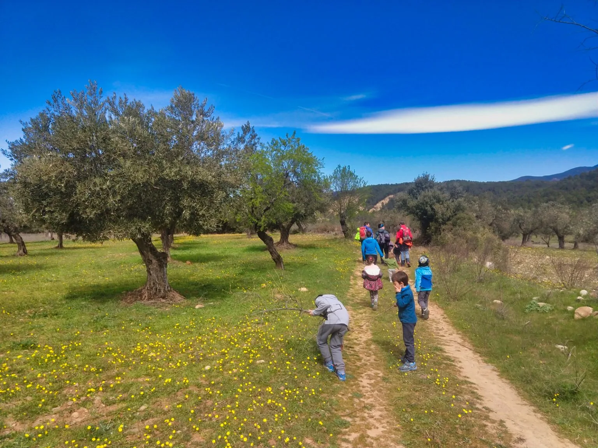
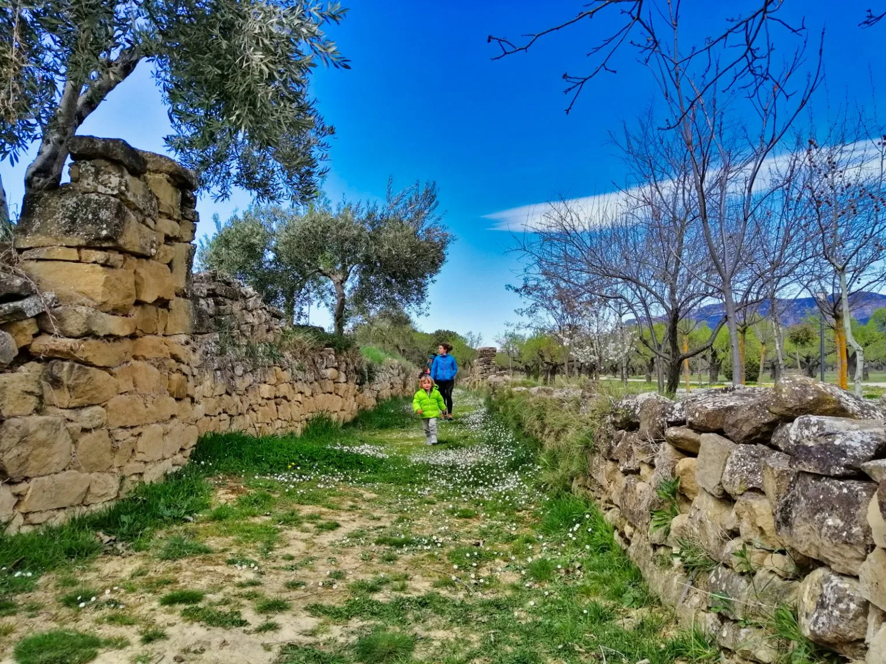
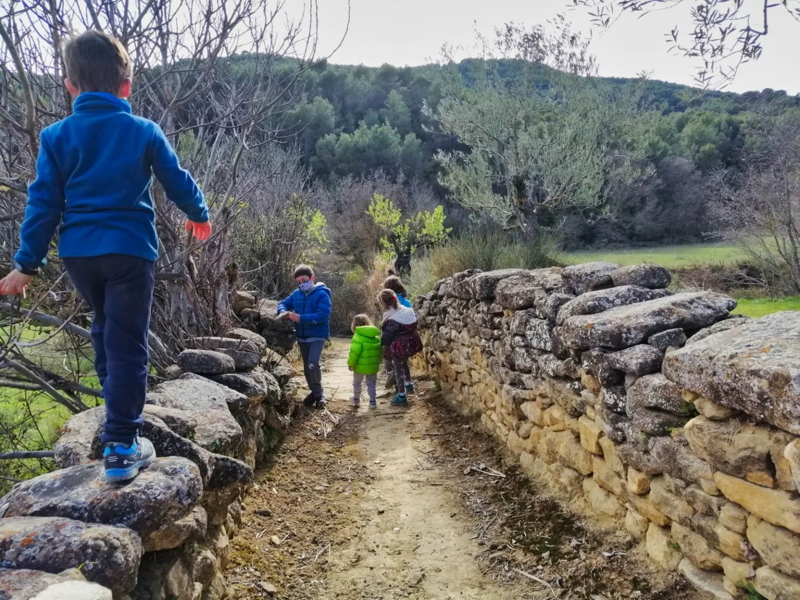
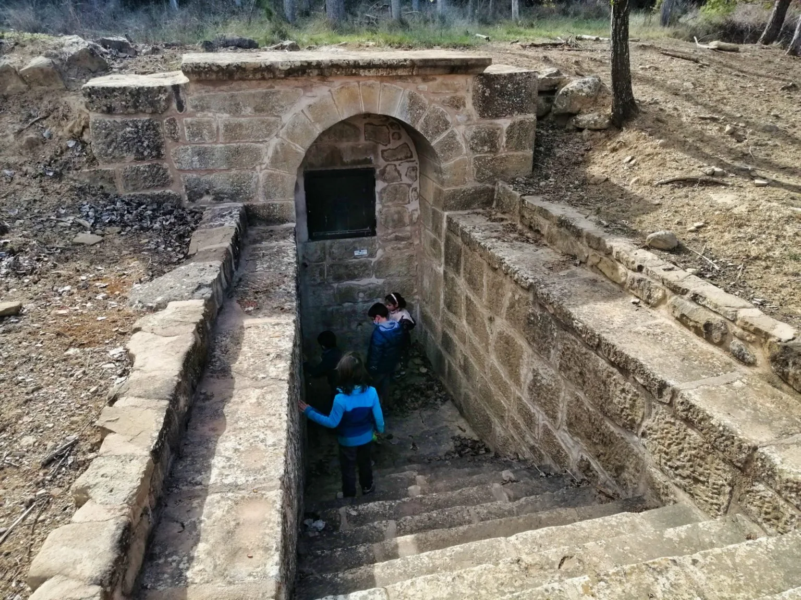

<h3>Sendero interpretativo sobre los usos del agua.</h3>
Este pasado domingo tocaba otra ruta infantil, y la elección del lugar estaba difícil dado la mala meteo anunciada: fuertes vientos de N y nevadas desaconsejaban mirar demasiado al Pirineo...

Una de las posibles rutas estaba en Santa Eulalia de Gállego, pero el corredor del Gállego está siempre tan ventilado estos días... Sin embargo la jornada levanta con vientos en calma, y eso nos anima a ir a descubrir la 'Ruta del Agua', con la alentadora promesa de un refollao a la vuelta en Ayerbe!

A eso de las 11.30am se dan cita en Santolaria Coco&Vir&Noa&Enzo, Chus&Iván&Víctor, Marga&Alejandra&Rubén y Alberto&Sami.

Puedes ver a continuación el track de la ruta:
<iframe src="https://www.alltrails.com/widget/map/ruta-del-agua-sta-eulalia-de-g-llego-92c3b91?hideName=true&u=m" width="100%" height="400" frameborder="0" scrolling="no" marginheight="0" marginwidth="0" title="AllTrails: Trail Guides and Maps for Hiking, Camping, and Running"></iframe>
A lo largo del día el viento fue haciendo acto de presencia, pero en general es un paseo suficientemente resguardado como para que no resultara molesto. Lo bueno del recorrido es que realiza dos bucles, por lo que permite la opción de 'abortar misión' a mitad, siendo el primer bucle del track aquí ofrecido como el más interesante.

Como incentivo para los niños, al finalizar el recorrido entramos en el pueblo y encontramos un parque infantil (#11 en el mapa).

Puedes descargar el <a href="https://galligueranatural.files.wordpress.com/2013/10/folletorutaagua.pdf" target="_blank" rel="noopener"><b>folleto oficial de la ruta en este enlace</b></a>.

Y te dejamos a continuación con algunas fotos de la jornada:

*Iniciando el segundo bucle*

*Aproximándonos al Mirador del Río (Foto: Chus)*

*Parte final del segundo bucle*

*Parte intermedia del primer bucle*

*Fuente d'o Lugar*

*Poco después del Pozo Chelo, terminando el primer bucle.*
