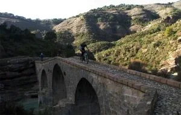
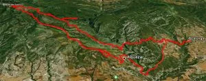

<table cellpadding="0" cellspacing="0" style="float: right; margin-left: 1em; text-align: right;"><tbody><tr><td style="text-align: center;"></td></tr><tr><td style="text-align: center;">Cruzando el Vero camino de Alquézar</td></tr></tbody></table>El pasado domingo, nueva quedada. En este caso, individuos de varios clanes (globeros, lentejos, ...) se dieron cita en Colungo para realizar otra de esas típicas rutas endureras por la sierra de Guara. ¿Típica ruta por Guara? Pues sí. Una continua lucha sin cuartel goma-mineral, mineral-goma, en la que las pulsaciones nunca bajan, ya sea por la dura subida o por la técnica bajada; un terreno perfecto para poner a punto las suspensiones, donde aprovecharemos cada mm de recorrido de los amortiguadores. 

Los avezados participantes fueron Roberto, Alfredo, Josete, Marco, Lola, Bati, jR, Marga, José, Fabrice, Lucía y Alberto.
<table align="center" cellpadding="0" cellspacing="0" style="margin-left: auto; margin-right: auto; text-align: center;"><tbody><tr><td style="text-align: center;"></td></tr><tr><td style="text-align: center;">La ruta: Colungo - Asque - Alquézar - Mesón de Sevil - Quizans - Basacol - Puente Villacantal - Asque - Colungo</td></tr></tbody></table>Cuatro números: 

Tiempo: mucha gente, todo el día y sin prisas.

Distancia: 35km 

Desnivel+ acumulado: 1500m 

Puedes ver aqui las <a href="https://picasaweb.google.com/111407206456416663507/111204ColungoAlquezarMesonDeSevilColungo?authkey=Gv1sRgCOP5vNKymfWZ5QE#" target="_blank">fotos de Jose</a> y las <a href="https://picasaweb.google.com/115384366959964769831/ColungoAlquezar011211?authuser=0&authkey=Gv1sRgCNqKm8WXkc_MjwE&feat=directlink" target="_blank">fotos de Luzia</a>.

