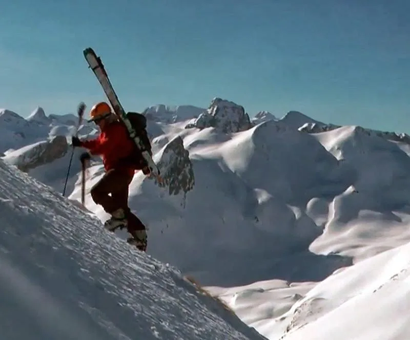

<table cellpadding="0" cellspacing="0" style="float: right; margin-left: 1em; text-align: right;"><tbody><tr><td style="text-align: center;"></td></tr><tr><td style="text-align: center;">Luis en las rampas finales al Peyreget.</td></tr></tbody></table>El pasado domingo tuvo lugar esta salida promocional de esquí de travesía de Peña Guara. Había que aprovechar y apuntarse: pocas veces un autobús te lleva a Portalet y te recoge en Astún!

El video recoge la variante larga de la ruta, ascendiendo primero al Pic de Peyreget y luego al Pic des Moines (Pico de los Monjes).

Jornada con viento de sur, casi inexistente por los valles pero muy fuerte en las cimas, lo que le dio bastante 'ambiente' sobre todo al Peyreget.

Puedes ver el <a href="http://p-guara.com/wordpress/secciones/esqui-de-montana/salida-promocional-travesia-portalet-astun-23022014/" target="_blank">relato de la jornada de Lola Mas en la web de Peña Guara</a>.

Y a continuación os dejamos con el video:

<iframe allowfullscreen="" frameborder="0" height="370" src="https://www.youtube.com/embed/PgbBlk9PWnM" width="657"></iframe>

