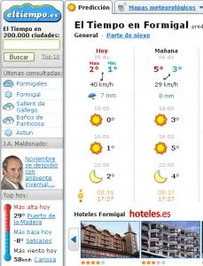
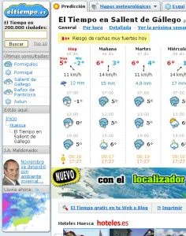
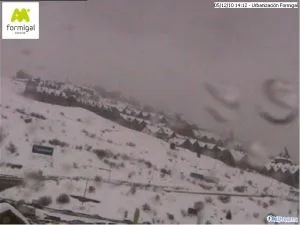
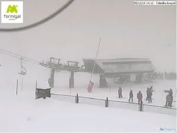

Eso me pregunto yo. Antes pensaba que no, que la meteo es la que es, y luego las predicciones aciertan o no... Pero hoy, por casualidad, he descubierto algo. ¿Cuánto habrá que pagar para que te pongan un sol? No sé si estaré equivocado, pero ¿tendrá Aramón presupuesto destinado a comprar soles?

Hoy en internete puede verse, al mismo tiempo:

Podemos decir que la estación de Formigal está junto a Sallent de Gállego, o sea que el tiempo más o menos será el mismo, o al menos parecido. Pero... ¿sol o nubes?

Veamos las webcam de Formigal (En la meteo dicen sol):

Y exactamente lo mismo ocurre en Benasque y Cerler. Da que pensar, no?

