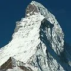

---
title: "Semana Santa 2012: la Trilogía alpina..."
publishDate: 2012-04-20T11:16:00Z
updateDate: 2015-04-06T10:28:40Z
draft: false
author: "AlbertoEpic"
excerpt: "Matterhorn (4.478m) Esta Semana Santa, Luzia y AlbertoEpic marcharon a los Alpes un año más para hacer la Chamonix-Zermatt, y un año más una meteo pestosa les hizo cambiar de planes. Tras el desencanto inicial, la incursión alpina resultó s"
category: "Esquí de travesía"
tags:
  - "Esquí de travesía"
  - "Uncategorized"
---

<table style="float: right; margin-left: 1em; text-align: right;" cellspacing="0" cellpadding="0">
<tbody>
<tr>
<td style="text-align: center;"></td>
</tr>
<tr>
<td style="text-align: center;">Matterhorn (4.478m)</td>
</tr>
</tbody>
</table>
Esta Semana Santa, Luzia y AlbertoEpic marcharon a los Alpes un año más para hacer la Chamonix-Zermatt, y un año más una meteo pestosa les hizo cambiar de planes. Tras el desencanto inicial, la incursión alpina resultó ser mejor incluso que la idea original: con actividades de día en Chamonix, Zermatt y Grindelwald.

Esquí de travesía, esqui de pista, freeride, turismo, vida social, piscina, kebab's, fondue, cultura,...
Debemos agradecer la hospitalidad de Almudena y su grupito de 'españolos' en Chamonix, la de Fran y Daniel en Zermatt, y la de Laura y su familia en Grindelwald.

A continuación, un video resumen:

<iframe src="https://www.youtube.com/embed/YSKkBL7wg70" width="657" height="374" frameborder="0" allowfullscreen="allowfullscreen"></iframe>

