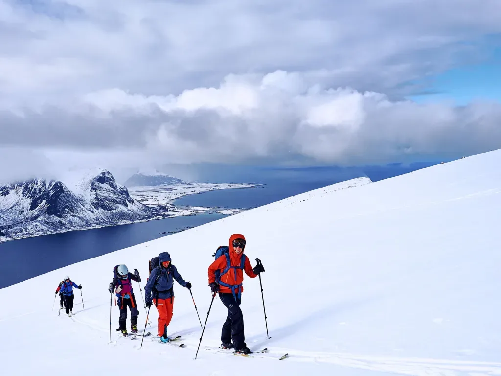
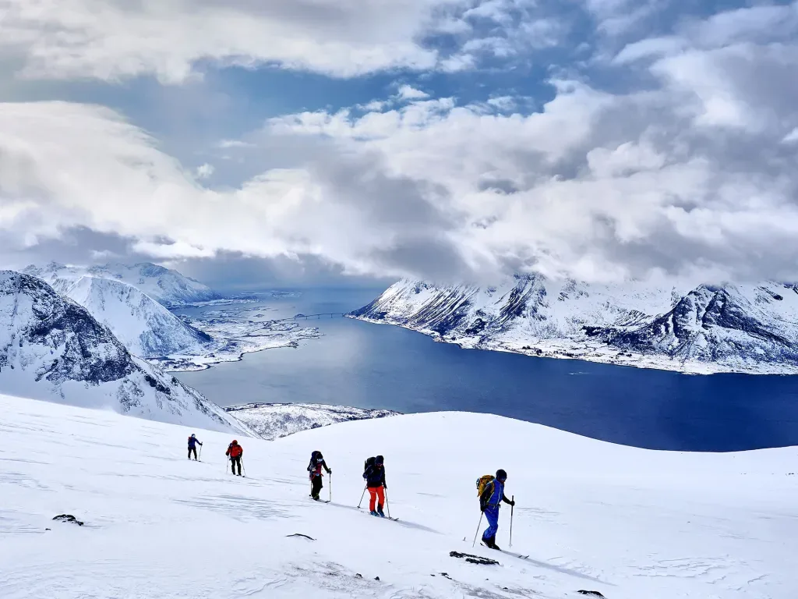

El cuarto día de skimo en las islas Lofoten, subimos al Svarttinden, al principio nevando, viento, sin muchas esperanzas... Pero una vez arriba, de repente se despejó. Una cima espectacular!!!

<iframe class="alltrails" src="https://www.alltrails.com/es/widget/map/map-4502591-10?scrollZoom=false&u=m&sh=w4k06q" width="100%" height="400" frameborder="0" scrolling="no" marginheight="0" marginwidth="0" title="AllTrails: Trail Guides and Maps for Hiking, Camping, and Running"></iframe>

*A ratos se abría un poco, dando ánimos para seguir adelante!*

*Para variar... mucho frío. Subimos con casi toda la ropa puesta.*

*Al ganar altura comenzamos a tener vistas del mar abierto.*

*Nos encontramos en la isla de Austvågsøya. La isla de al lado, unida por un puente, se llama Vestvågøy.*

*Los frentes van viniendo del océano. Ahora nos tocaba nubarrón, pero luego llegaba otro claro.*

*Parece el fin del mundo... Menos mal que antes hemos visto la luz al otro lado del túnel!*

*No hay que darse prisa en llegar a la cima... tienen que pasar todos estos nubarrones.*

*Tras un rato en la cima, el frente nuboso pasa de largo y ahora nos toca un poco de sol!*

*Pero no hay que despistarse, que enseguida llega por allí el siguiente frente...*

Puedes volver al índice general <strong><em><a href="https://soloquedalopeor.com/2024/05/28/skimo-en-las-lofoten/" data-type="post" data-id="108156">haciendo click aquí</a></em></strong>.
