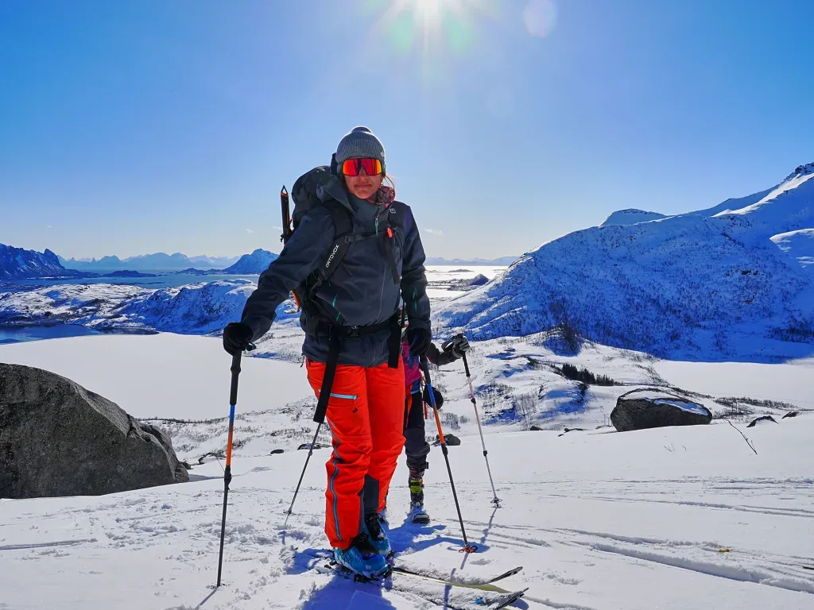
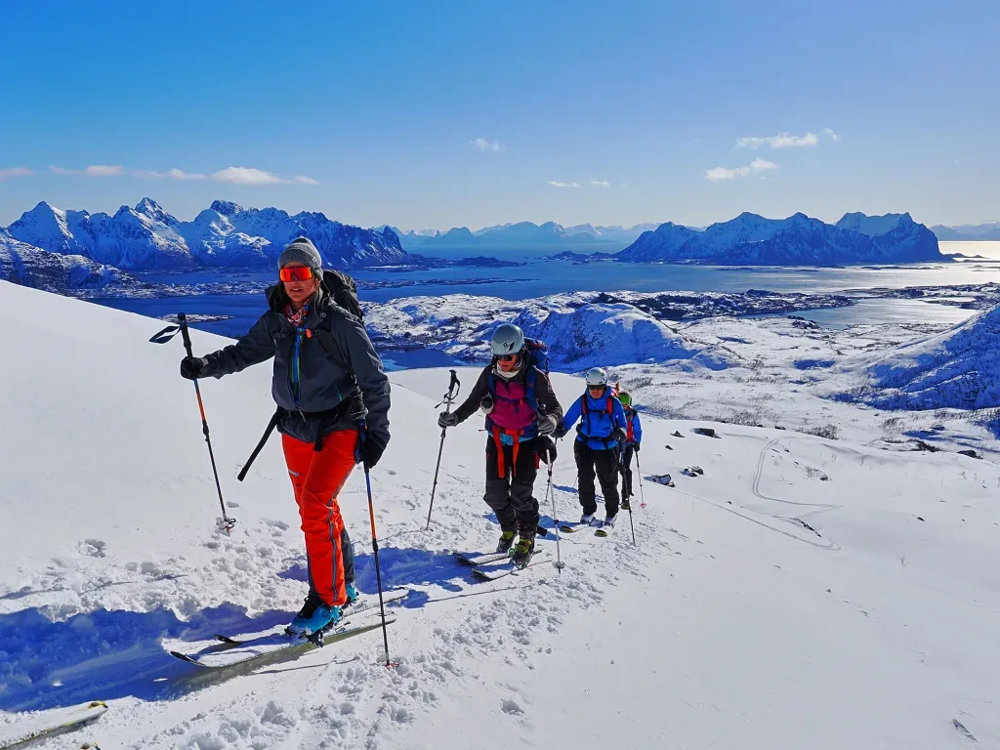
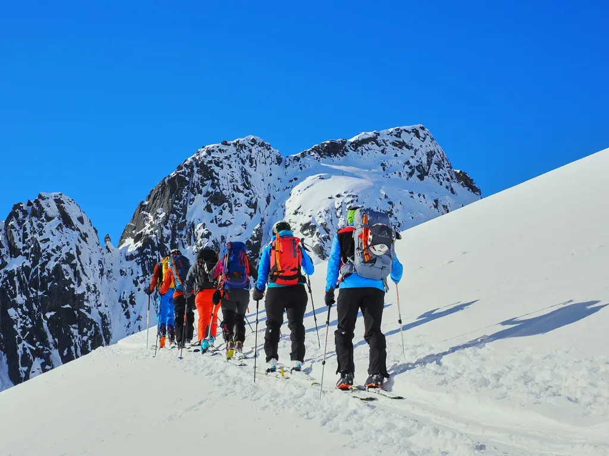
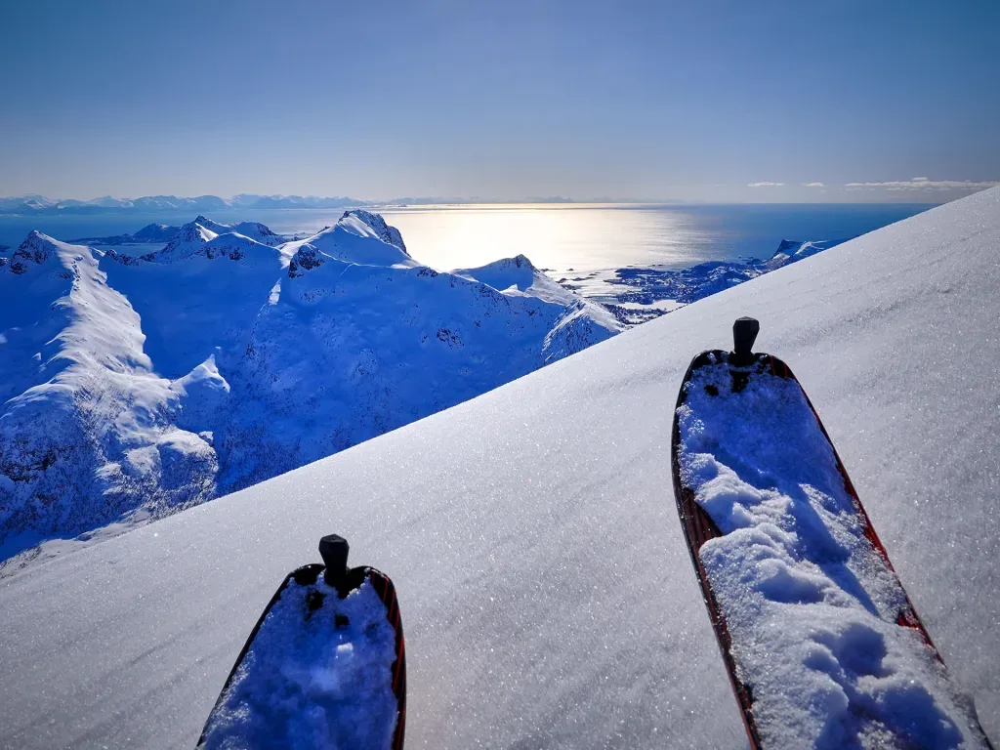
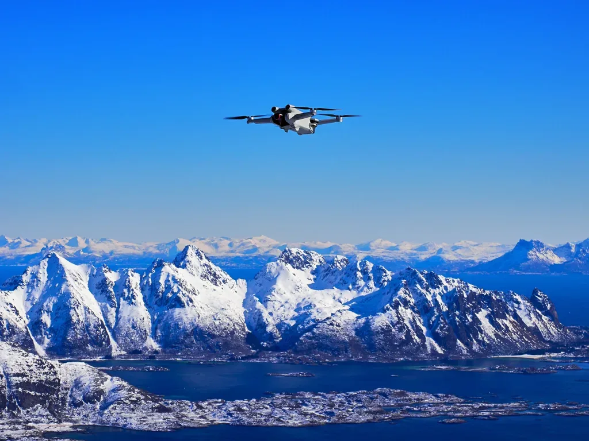
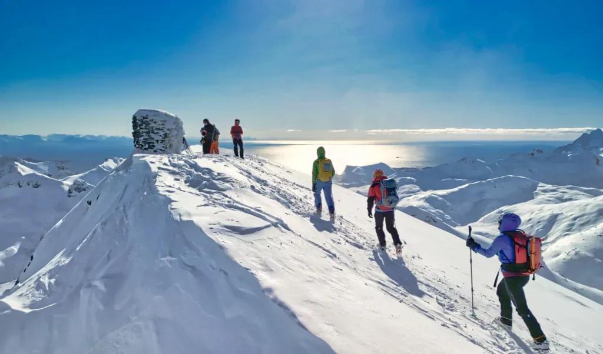

Esto no hace nada más que mejorar día tras día... El quinto día de actividad en las Lofoten nos sorprende con la mejor meteo hasta la fecha. Frío, para que la nieve esté perfecta todo el día, y por fin un día totalmente despejado y con un viento razonablemente 'menos fuerte' como para poder volar el dron!

<iframe class="alltrails" src="https://www.alltrails.com/es/widget/map/map-26751be-9?scrollZoom=false&u=m&sh=w4k06q" width="100%" height="400" frameborder="0" scrolling="no" marginheight="0" marginwidth="0" title="AllTrails: Trail Guides and Maps for Hiking, Camping, and Running"></iframe>

De esta manera, nuestro especialista pudo recrearse con las fotos a la subida, y adelantarse en el último tramo para esperar al grupo en la cima con el dron en el aire. Además, le dio tiempo a sacar una foto esférica que ha sido debidamente procesada por el equipo <strong>Pano360 de SQLP</strong> para ofrecerte este <strong><a href="https://pano360.soloquedalopeor.com/panorama/rundjfellet-803m-islas-lofoten-noruega/" data-type="link" data-id="https://pano360.soloquedalopeor.com/panorama/rundjfellet-803m-islas-lofoten-noruega/" target="_blank" rel="noreferrer noopener">panorama esférico con las cimas etiquetadas</a></strong>.

*Hoy sí que sí, meteo perfecta!*

*Uno no puede permanecer impasible ante semejantes paisajes...*

*China-chana...*

*Tras un rato de sólo ver nieve en una vaguada, salimos a una arista y... buaaaaalaaaa!*

*Resulta que avanzamos por unos montes rodeados de 'charcos' por todas partes...*

*Otro buen 'photocall', de camino al collado final.*

*Esperando en la cima es el momento para una foto-homenaje al 'Albertdrón'...*

*Pisoteando bien el área de la cima, para que se note que hemos estado.*

Puedes volver al índice general <strong><em><a href="https://soloquedalopeor.com/2024/05/28/skimo-en-las-lofoten/" data-type="post" data-id="108156">haciendo click aquí</a></em></strong>.
