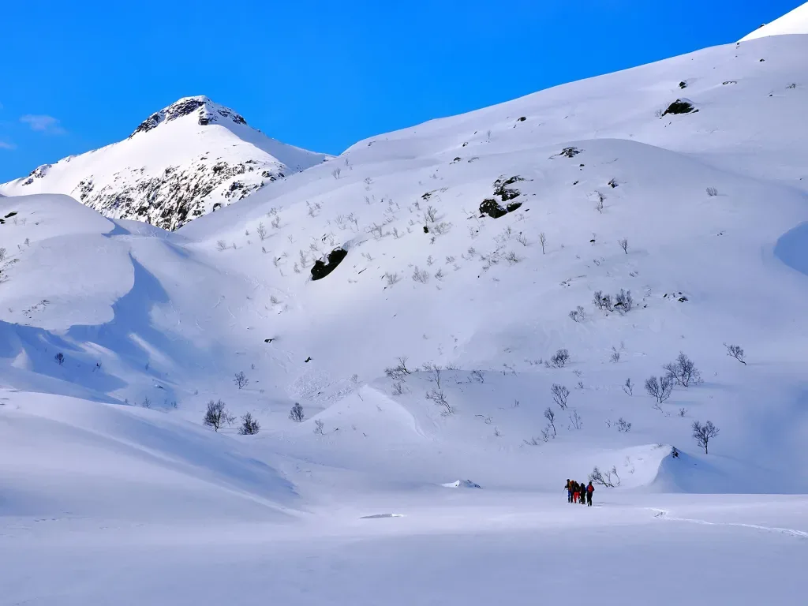
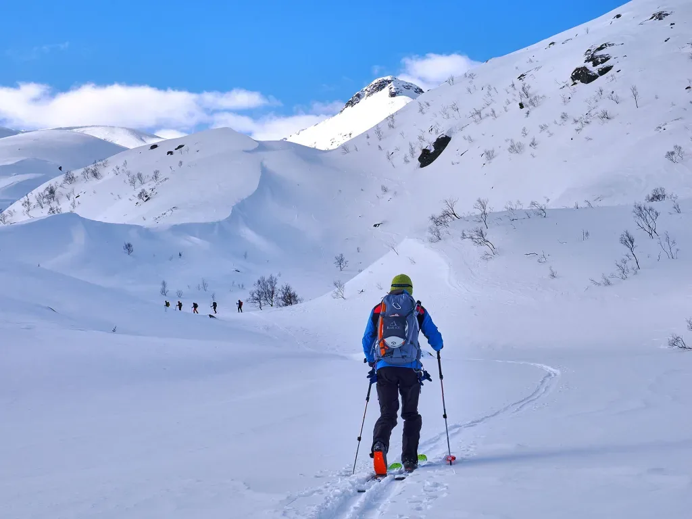

Esta es nuestra última actividad en Noruega. Mañana toca avión y para casa. El grupo se deja llevar, y lleno de espíritu explorador, decide dejar la ascensión prevista e improvisar una ruta circular en busca de unas buenas palas de bajada (En realidad, en este lugar y en estos días, la bajada siempre es espectacular en cualquier orientación y a cualquier hora!)

<iframe class="alltrails" src="https://www.alltrails.com/es/widget/map/map-ff450ba-11?scrollZoom=false&u=m&sh=w4k06q" width="100%" height="400" frameborder="0" scrolling="no" marginheight="0" marginwidth="0" title="AllTrails: Trail Guides and Maps for Hiking, Camping, and Running"></iframe>

Un día más, buenas condiciones para fotos y drone, el pobre AlbertoEpic va sobrepasado por los acontecimientos... Ascienden al Store Kvittind, desde donde se aprovecha para sacar una nueva foto esférica desde el dron. Como siempre, procesada debidamente por <strong><a href="https://pano360.soloquedalopeor.com/" data-type="link" data-id="https://pano360.soloquedalopeor.com/" target="_blank" rel="noreferrer noopener">Pano360</a></strong> para obtener esta <strong><a href="https://pano360.soloquedalopeor.com/panorama/store-kvittind-696m-islas-lofoten-noruega/" data-type="link" data-id="https://pano360.soloquedalopeor.com/panorama/store-kvittind-696m-islas-lofoten-noruega/" target="_blank" rel="noreferrer noopener">foto esférica con cimas etiquetadas</a></strong>.

*Desde el borde de la carretera, en el lugar donde comenzamos hoy.*

*Nosotros a lo nuestro, ignorando nubes, ventisca, y demás meteoros pasajeros...*

*Otro de los muchos 'photocalls' del viaje.*

*Se van alternando planos (Lagos helados) con pequeños repechos, todavía con vegetación en la parte baja.*

*Un día más, la calidad de la nieve es excepcional!*

*El cruce de este lago helado resultó estar más resguardado y la ventisca nos dio una pequeña tregua.*

*La ruta continúa más o menos siguiendo la línea sol-sombra...*

*En el tramo final de ascenso al collado. Ganando los últimos metros de desnivel+ en este viaje...*

Puedes volver al índice general <strong><em><a href="https://soloquedalopeor.com/2024/05/28/skimo-en-las-lofoten/" data-type="post" data-id="108156">haciendo click aquí</a></em></strong>.
