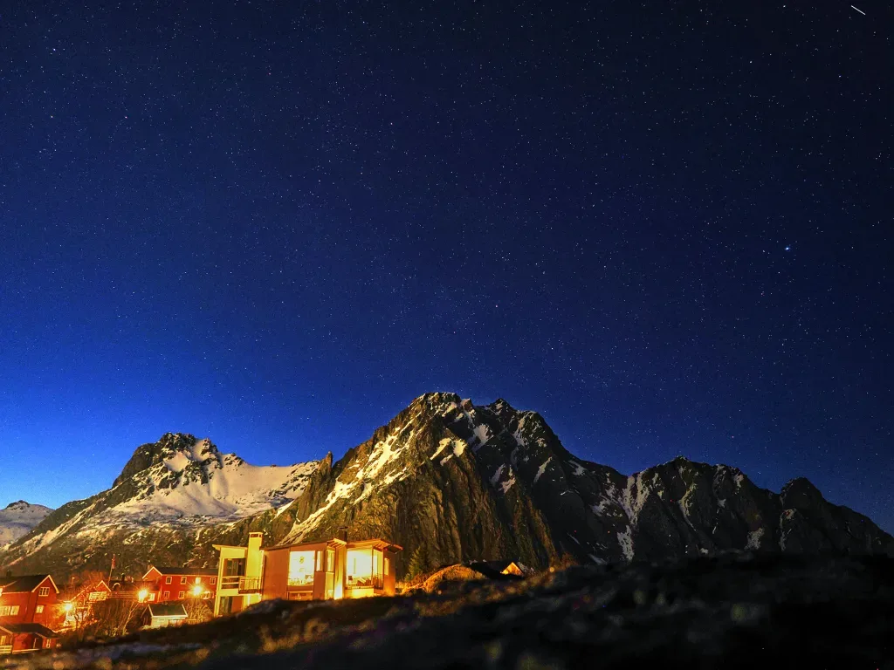
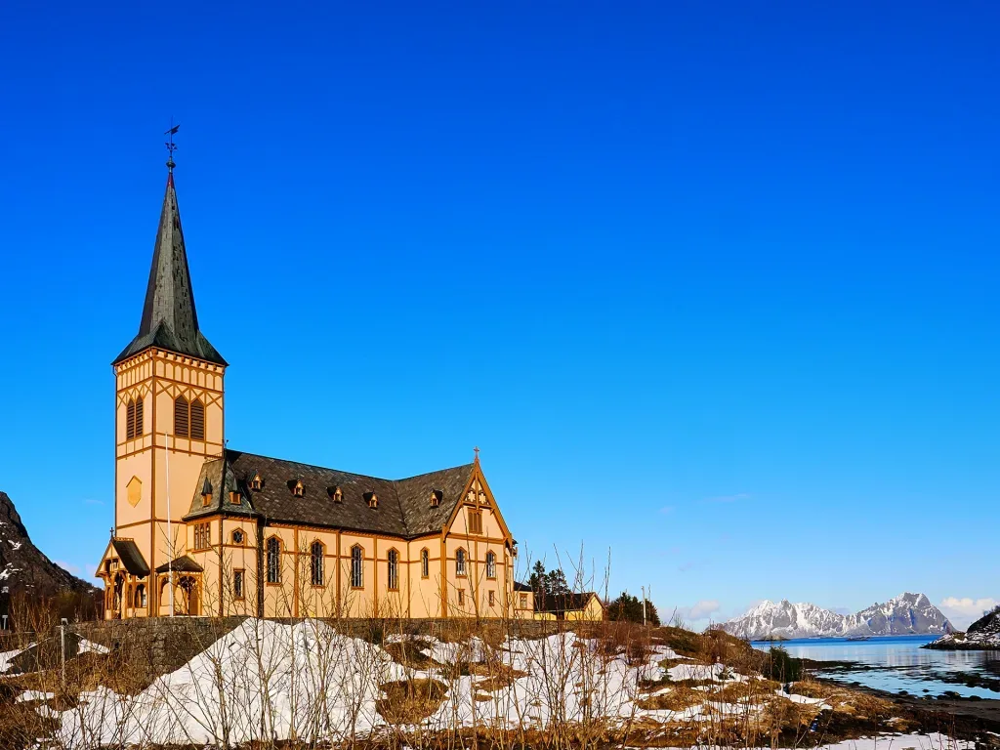
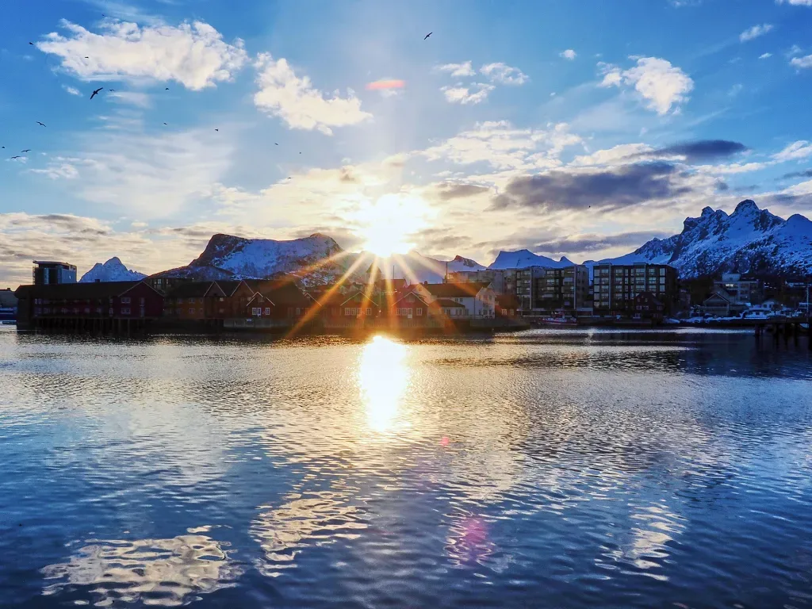
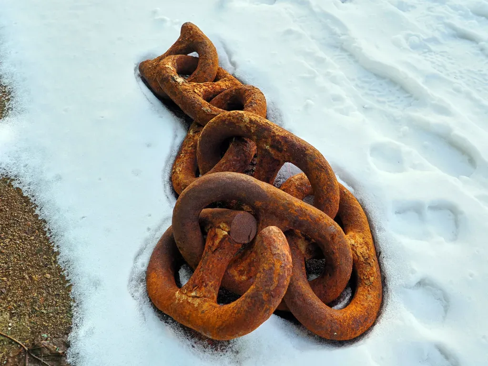

## <em>SkiLof24</em>

Con esta entrada pretendemos unificar una serie de información acerca del viaje de nuestro especialista AlbertoEpic a Noruega, a las islas Lofoten, para salvar la temporada de skimo. Comenzamos con su escalofriante testimonio:

<blockquote class="wp-block-quote">
"La temporada de esquí de travesía '23-'24 hasta mediados de febrero estaba siendo un auténtico fracaso. Directamente, no había nieve. Así que cuando mi amiga Almu me llamó y me tentó para unirme a un viaje de skimo en las Lofoten para las vacaciones de Semana Santa... No pude negarme a semejante proposición indecente!

Era un plan más turístico que deportivo, lo cual me permitiría moverme sin agobios con todos mis gadgets a cuestas, a pesar de encontrarme entonces en un estado de forma deplorable debido a mi cuasi nulo rodaje a falta de 2 meses para el viaje. Era, sin lugar a dudas, una situación 'win-win', a pesar de que no conocía al resto de los integrantes del viaje.

Como había predicho Almu, era un grupo de gente encantadora y la convivencia no pudo haber sido más fácil. Fue, en definitiva, un exitazo de viaje en todos los sentidos!" :-)
<cite>AlbertoEpic</cite></blockquote>

Y bueno, tras sus palabras, aquí va un vídeo resumen de la semana, con imágenes del dron y la cámara:

<figure class="wp-block-embed is-type-video is-provider-youtube wp-block-embed-youtube wp-embed-aspect-16-9 wp-has-aspect-ratio">

<iframe width="560" height="315" src="https://www.youtube.com/embed/1A2mVnLzIYE" title="YouTube video" frameborder="0" allow="accelerometer; autoplay; clipboard-write; encrypted-media; gyroscope; picture-in-picture" allowfullscreen></iframe>

</figure>

A continuación detallamos brevemente las actividades, día a día. En una serie que vamos a llamar '<strong>SkiLof</strong>' (Skimo en las Lofoten):

<ul>
<li><strong><a href="https://soloquedalopeor.com/2024/03/31/skilof-1-varden-700m/" data-type="post" data-id="108142">SkiLof 1 - Varden (700m)</a></strong></li>

<li><strong><a href="https://soloquedalopeor.com/2024/04/01/skilof-2-torksmannen-755m/" data-type="post" data-id="108144">SkiLof 2 - Torksmannen (755m) </a></strong></li>

<li><strong><a href="https://soloquedalopeor.com/2024/04/03/skilof-3-un-garbeo-desde-el-trollfjord/" data-type="post" data-id="108146">SkiLof 3 - Paseo desde el Trollfjord</a></strong></li>

<li><strong><a href="https://soloquedalopeor.com/2024/04/04/skilof-4-svarttinden-736m/" data-type="post" data-id="108150">SkiLof 4 - Svarttinden (736m)</a></strong></li>

<li><strong><a href="https://soloquedalopeor.com/2024/04/05/skilof-5-rundfjellet-803m/" data-type="post" data-id="108152">SkiLof 5 - Rundfjellet (803m)</a></strong></li>

<li><strong><a href="https://soloquedalopeor.com/2024/04/06/skilof-6-store-kvittind-696m/" data-type="post" data-id="108154">SkiLof 6 - Store Kvittind (696m)</a></strong></li>
</ul>

*Allí lo más normal son las casas de madera. A saber qué tipo de barnices utilizan para que eso aguante...*

*Hay que contar que, si el cielo está despejado, las auroras boreales te van a quitar horas de sueño...*

*Svolvaer, con el Fløya, o también Fløyfjellet (590m) detrás. Esperando la aurora boreal...*

*La iglesia de Vågan, construída en madera, y conocida como la catedral de Lofoten.*

*Pesquero en el puerto de Svolvaer.*

*A esas latitudes, los atardeceres duran varias horas...*

*Unos eslabones de cadena sobre la nieve, en el puerto de Svolvaer.*
