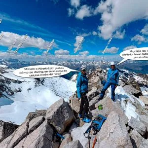

## Despidiendo la temporada de esquí de travesía con un BTT+Skimo...

El pasado sábado, los especialistas de SQLP Silvia, Miriam y AlbertoEpic se hallaban en el Lac d'Oredon, en la Reserva Natural del Néouvielle, para dar por finiquitada la temporada de skimo '22/23, una temporada inusualmente corta, y esperemos que no sea la norma en el futuro... :-(

Ya que la carretera hasta el Lac d'Aubert está cerrada hasta finales de mayo, la opción fue subir pedaleando. Portear en btt nunca ha sido demasiado agradable a la subida, pero compensa con creces a la bajada!

Dejan las bicis junto a la presa, portean a pie escasos minutos y ya calzan esquís para ir buscando lenguas de nieve. Menuda nevera gigante tienen montada aquí en el Néouvielle! Es un gran lugar para acudir cuando la nieve escasea ya en todos los rincones del Pirineo...

Según la meteo, por la tarde se esperan tormentas, pero la mañana está siendo perfecta (Las primeras gotas cayeron con nuestros protagonistas ya en la furgo).  En la cima, AlbertoEpic aprovecha para sacar otra foto esférica y ampliar así el catálogo de<strong> <a rel="noreferrer noopener" href="https://pano360.soloquedalopeor.com/" target="_blank">Pano360 de SQLP</a></strong>. Puedes verla <strong><a rel="noreferrer noopener" href="https://bit.ly/neouvielle" target="_blank">haciendo click aquí</a></strong>.

Puedes ver una animación del track sobre un mapa en 3D:

<figure class="wp-block-video"><video controls src="https://video.relive.cc/elif-89361185011_garmin-health_1683712362409.mp4"></video></figure>

Y debajo puedes ver un vídeo corto de la actividad. En esta ocasión, y para variar, hemos preparado el vídeo en formato vertical, para verlo mejor en el móvil.

<figure class="wp-block-embed is-type-video is-provider-youtube wp-block-embed-youtube wp-embed-aspect-16-9 wp-has-aspect-ratio">

<iframe width="560" height="315" src="https://www.youtube.com/embed/GOx3eoaHQv8" title="YouTube video" frameborder="0" allow="accelerometer; autoplay; clipboard-write; encrypted-media; gyroscope; picture-in-picture" allowfullscreen></iframe>

</figure>

Y eso es lo que dio de sí esta temporada de nieve... El domingo, con mala meteo en Francia, nuestros protagonistas regresaron a España y pararon en Aínsa para un poco de BTT, que sin mochila con esquís es algo bastante más agradable ;-).

A continuación, algunas fotos del sábado:

<figure class="wp-block-image size-large"><figcaption class="wp-element-caption">En la parte inicial del bici-porteo... ¿Pero dónde está la nieve?</figcaption></figure>

<figure class="wp-block-image size-large"><figcaption class="wp-element-caption">Algo más arriba el tema ya no resulta tan mosqueante... Al menos en el Néouvielle queda nieve!</figcaption></figure>

<figure class="wp-block-image size-large"><figcaption class="wp-element-caption">Después de foquear casi 1.000m+, pasamos a piolet-crampones para los últimos metros a cima.</figcaption></figure>

<figure class="wp-block-image size-large"><figcaption class="wp-element-caption">Miriam flanqueando la cima hacia la izquierda...</figcaption></figure>

<figure class="wp-block-image size-large"><figcaption class="wp-element-caption">En un breve tramo mixto que da acceso a la cumbre.</figcaption></figure>

<figure class="wp-block-image size-large"><figcaption class="wp-element-caption">Silvia, Miriam y AlbertoEpic, exultantes en la cima del Néouvielle (3.091m).</figcaption></figure>

<figure class="wp-block-image size-large"><figcaption class="wp-element-caption">Daban lluvias, pero la meteo por la mañana ha sido perfecta! Se está muy bien... pero toca bajar de aquí.</figcaption></figure>
