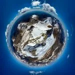

<h3>- Combinada BTT+porteo+Skimo -</h3>
El pasado 18 de abril los especialistas de SQLP, Myriam y AlbertoEpic, realizaron una actividad, digamos, original (Teniendo en cuenta que hoy en día cada vez más gente hace de todo). La idea no es nueva, fue una actividad ya realizada por AlbertoEpic con el mítico Dr. LaTrek unos 15 años atrás (Es vergonzoso cómo pasa el tiempo!!!).

Consiste en salir en BTT del refugio de Bujaruelo, con los esquís en la mochila, y subir pedaleando hasta la cabaña de Otal. Allí dejaron las bicis, y siguieron porteando hasta el comienzo de la nieve. Ya por fin en la nieve, se calzan los esquís y les quedan por delante algo más de 1.000m+ de desnivel perfectamente esquiables hasta la antecima, donde sólo resta una sencilla arista mayoritariamente de nieve, con algunos escasos metros algo más afilados de lo normal...

Y hasta la cima arrastró AlbertoEpic toda la artillería: dron, GoPro,... para que Producciones SQLP os pueda ofrecer el consiguiente videoreportaje de la actividad:https://youtu.be/NvZ0JszhAHsSi te ha motivado y estás interesado en ir tras los pasos de nuestro equipo, te ofrecemos a continuación el mapa con el track del itinerario seguido, con los puntos donde hicieron las transiciones bici-porteo y porteo-skimo.
<iframe src="https://www.alltrails.com/es/widget/map/tende-era-btt-skimo-c559da2?scrollZoom=false&hideName=true&u=m" width="100%" height="400" frameborder="0" scrolling="no" marginheight="0" marginwidth="0" title="AllTrails: Trail Guides and Maps for Hiking, Camping, and Running"></iframe>
Y para tener una idea más visual de la actividad, bajo estas líneas tienes el track animado en un mapa 3D virtual:https://video.relive.cc/24705334298_garmin-health_1619513831659.mp4
<h3><a href="https://pano360.soloquedalopeor.com/panorama/tendenera-2-845m/" target="_blank" rel="noopener">PanoSphere desde la cima...</a></h3>Por supuesto no podía faltar una de nuestras fotos esféricas desde la cumbre, con infinidad de cimas etiquetadas!!! Haz click en la imagen del mini-planeta de la izquierda para verla en nuestra web dedicada: <b>https://pano360.soloquedalopeor.com</b>

La jornada resultó como viene siendo habitual en un día de esquí de primavera: desde el momento "yo no salgo del coche! No hay nieve, hace mucho frío, un viento racheado muy desagradable... (Ande vamo, zeñorita, ande vamo?)", pasando por momentos de silencioso esfuerzo mantenido, alegría contenida en una cima totalmente invernal tras una concentrada subida con cuchillas por la nieve helada, y terminando con una jubilosa bajada por la nieve 'mantequilla'!

Definitivamente los momentos de más frío de toda la actividad fueron los vividos junto al refugio de Bujaruelo, cargando/descargando las bicis en la furgo... Sin sol, y con ese molesto viento racheado... ufff!

Te dejamos con unas fotos de la actividad:
<figure>
											<figcaption>Tras unos primeros momentos soportando un helador y desagradable viento racheado, por fin salimos al sol...</figcaption>
</figure>
<figure>
											<figcaption>Recorriendo el valle de Otal. Al final de esta laaaarga recta dejaremos las bicis.</figcaption>
</figure>
<figure>
											<figcaption>Empezamos a ver la cabaña de Otal. Desde allí, un breve porteo hasta la lengua de nieve que hay sobre AlbertoEpic.</figcaption>
</figure>
<figure>
											<figcaption>En pleno porteo, un 'posado' de Myriam hacia el valle de Otal. Puerto de Bujaruelo al fondo.</figcaption>
</figure>
<figure>
											<figcaption>Ya con los esquís. Valle de Otal: invierno en su ladera N, primavera en la S.</figcaption>
</figure>
<figure>
											<figcaption>Llegando a la antecima, dejamos esquís y pasamos a crampones. Cada vez menos viento y mejor meteo...</figcaption>
</figure>
<figure>
											<figcaption>La arista cimera se va afilando, pero no supone mayor problema. Al fondo, la cima...</figcaption>
</figure>
<figure>
											<figcaption>Desde el dron: AlbertoEpic en la cima de Tendeñera. Myriam ya regresando, algo más allá del paso clave de la arista.</figcaption>
</figure>
<figure>
											<figcaption>Glorioso descenso, rebasadas las heladas palas superiores, sobre nieve 'mantequilla'...</figcaption>
</figure>
<figure>
											<figcaption>Magnífico contraste entre las laderas Norte y Sur...</figcaption>
</figure>
<figure>
											<figcaption>Todo el descenso perseguidos por las sombras. Myriam bajo la atenta mirada del pico de Otal.</figcaption>
</figure>
<figure>
											<figcaption>Llegando de bajada a la cabaña de Otal. Ya sólo faltará sentarnos en las bicis y dejarnos escurrir hasta Bujaruelo!</figcaption>
</figure>
