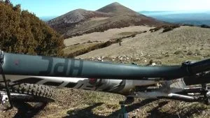

---
title: "SOS: la sierra de Guara te necesita!!!"
publishDate: 2013-08-02T18:52:00Z
updateDate: 2015-04-06T10:28:36Z
draft: false
author: "AlbertoEpic"
excerpt: "Guara, paraíso para la BTT Una noticia lamentable, y es que desde el Gobierno de Aragón, en la nueva redacción del Plan Rector de Uso y Gestión que actualmente se encuentra en periodo de alegaciones, se quiere prohibir la bici en todos los "
category: "Otros"
tags:
  - "Uncategorized"
---

<table cellpadding="0" cellspacing="0" style="float: right; margin-left: 1em; text-align: right;"><tbody><tr><td style="text-align: center;"></td></tr><tr><td style="text-align: center;">Guara, paraíso para la BTT</td></tr></tbody></table>
Una noticia lamentable, y es que desde el Gobierno de Aragón, en la nueva redacción del Plan Rector de Uso y Gestión que actualmente se encuentra en periodo de alegaciones, se quiere prohibir la bici en todos los senderos y caminos del Parque Natural de la Sierra y Cañones de Guara, acotándose su uso exclusivamente a los lugares permitidos para el tráfico rodado. Esto es, nos igualan a los coches, motos, camiones... como ha ocurrido ya en otros lugares.

Desde SóloQuedaLoPeor animamos a, conjuntamente con muchas otras asociaciones y administraciones de la zona, poner nuestro granito de arena para revertir esta legislación, de manera que se reconozca la bici como otra actividad más del medio natural, como puede ser el senderismo, barrancos, escalada, caballos... Que se valore el nulo impacto que hace el ciclista en Guara, y que se solucionen los problemas que puedan surgir uno a uno, y no con una decisión salomónica que, si bien corta de raíz el problema, crea otros mucho mayores, porque la bici es una de las actividades de futuro en cuanto a turismo sostenible, y más en esta amplia zona de Huesca, como ya han demostrado los chicos de Zona Zero (Aínsa) en sus dos años y medio de andadura.

<a href="http://www.musibel.com/Alegacion%20definitiva%20BTT.doc" target="_blank">Adjuntamos en este post el <b>texto de alegaciones</b></a> que se ha consensuado entre varias asociaciones y administraciones (Comarcas de Somontano y Alto Gállego, Zona Zero, Centro BTT Alto Gállego, Asociaciones empresariales de Sierra de Guara y Sobrarbe, INIZIA...)

Si estáis de acuerdo con él y queréis ayudar, podéis todos (particulares, organizaciones, empresas, administraciones, asociaciones...) firmarlo y hacerlo llegar por carta, antes del 16 de agosto, al Gobierno de Aragón (la dirección está al final del texto)

<b>Regulación, uso compartido y sentido común, SI</b>. Prohibiciones arbitrarias, NO. Hagamos fuerza, que se nos respete!!

