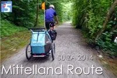

Tras series de éxito como <a href="https://soloquedalopeor.com/2011/10/31/la-india-una-semana-despues/" target="_blank">Uttarakhand 2011</a>, <a href="https://soloquedalopeor.com/2011/04/27/oberland-2011-la-serie/" target="_blank">Oberland 2011</a>, <a href="https://soloquedalopeor.com/2012/07/29/usa-2012-la-serie/" target="_blank">USA 2012</a>,... Producciones SoloQuedaLoPeor comienza una nueva etapa, centrada en actividades familiares. El equipo de SQLP ha crecido, y a los especialistas Luzia y AlbertoEpic les acompaña ahora el pequeño Samuel, 'Sami'.

En esta nueva serie,  nuestros especialistas cruzarán Suiza desde Romanshorn (NE) hasta Lausanne (W). En bicicleta, sin prisas y con el pequeño Samuel en un remolque...

Te dejamos con el primer episodio de la serie Mittelland Route.

<iframe allowfullscreen="" frameborder="0" height="370" src="https://www.youtube.com/embed/ThtmZYNiWtU" width="657"></iframe>

