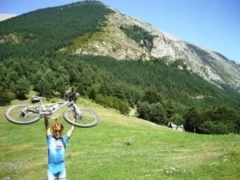
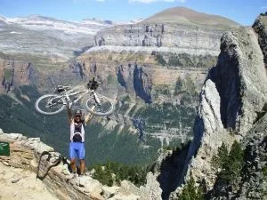
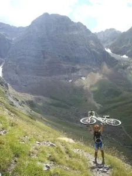
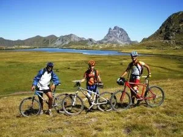
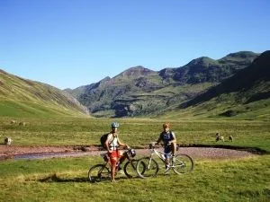

Buenas buenas! Me estreno en este blog con una mini crónica del viajecito que he hecho esta semana pasada con 2 amigos de Madrid cruzando el Pirineo Aragonés.

Han sido un total de 5 etapas, unos 300km aproximadamente, una media de 7-8 horas diarias, un porrón de metros de desnivel... cuando tenga los datos exactos del GPS de mi amigo ya los pondré! Las etapas han sido las siguientes:

Día 1 Campo - Escalona: por el collado de Cullibert, una subida muy exigente hasta este collado y una gran bajada por pista de casi 1000m de desnivel hasta Escalona. Etapa cortita de menos de 5h ya que el bus nos dejó en Campo a las 13h.

<i>En el Collado de Cullibert (1455m)</i>

Día 2 Escalona - Broto: por la Sierra de las Cutas, la etapa más bonita y una de las de mayor desnivel. Muchos ya la conocéis y creo que poco hay que decir de las increíbles vistas que ofrece esta pista hasta hace poco prohibida para las bicis... El plan original era terminar en Bujaruelo pero uno de los compañeros petó el núcleo de los piñones y tuvimos que bajar a Broto para que volviera a Huesca haciendo autostop jeje

<i>En uno de los increíbles miradores de Ordesa</i>

Día 3 Broto - Formigal: por Bujaruelo, subida por el valle de Otal hasta el collado de Tendeñera (2.327m), punto más alto de nuestra ruta, para bajar por el valle de la Ripera hasta Panticosa. Fue el día más duro de todos porque desde la cabaña de Otal nos tocó portear (700m de desnivel en casi 3h...) y después el primer tramo de bajada apenas se dejaba ciclar... Y encima para terminar teníamos que subir de Panticosa hasta Formigal!! Menos mal que aquí nos estaba esperando José Orte y su madre que nos acogieron de una manera increíble y nos agasajaron con todo tipo de comodidades, muchísimas gracias!! Aquí en Formigal se nos unió de nuevo el compañero averiado que cogió una rueda mía vieja para continuar la ruta.

<i>Llegando al valle de la Ripera</i>

Día 4 Formigal - Candanchú: cruzamos por los ibones de Anayet, tuvimos que portear 1h más o menos para alcanzarlos, nos dimos un bañito disfrutando de las hermosas vistas y nos bajamos por Canal Roya terminando en la cima del Somport donde pasamos la última noche. Esta fue la etapa más corta de todas.

<i>En los Ibones de Anayet</i>

Día 5 Candanchú - Hecho - Jaca: nos bajamos a Les Forges de Abel y de aquí comenzamos la subida por Francia hasta el collado fronterizo d'Escalé para cruzar a Aguas Tuertas. Nos tocó portear menos de 1h por el valle francés puesto que es Parque Nacional y nos la jugamos un poco si nos pillaban los forestales... Bajamos a Hecho por Guarrinza y por la carretera de Oza y para terminar bien nos comimos 44km de carretera hasta Jaca ya que teníamos allí el coche para volver a Huesca...

<i>En Aguas Tuertas</i>

Ha sido una gran experiencia, era un plan que ya tenía en mente hace dos o tres años y por fin he podido realizarlo! Tenéis alguna crónica más extensa en mi <a href="http://jorgit-o.blogspot.com/">blog</a> y próximamente espero tener un vídeo que se va a currar uno de mis colegas de la ruta.

Un placer colaborar en este blog!

Jorgito

