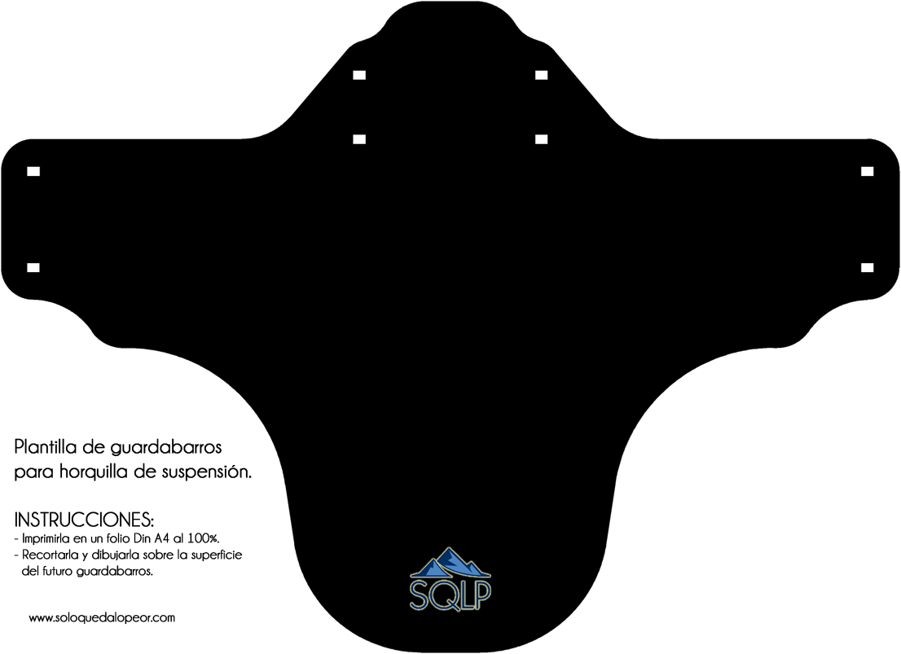
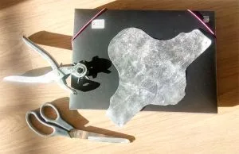
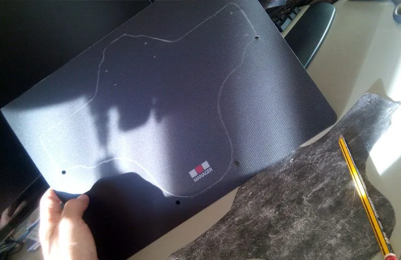
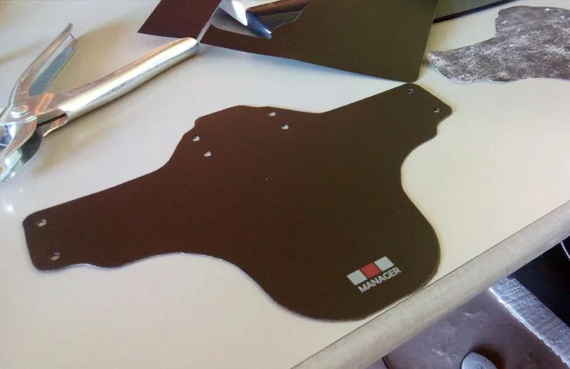
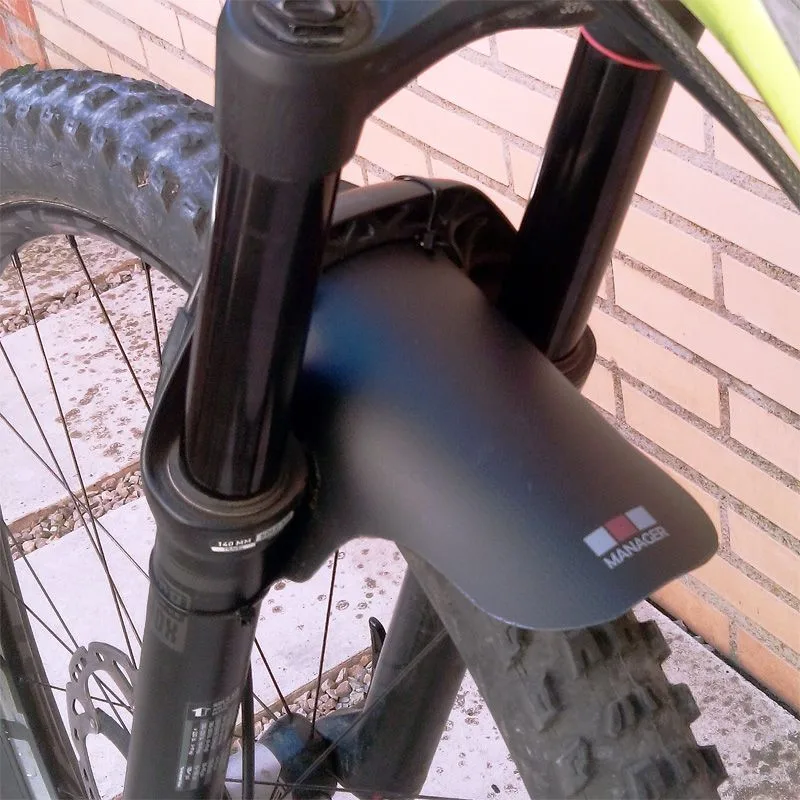

Hoy nos salimos un poco de la temática habitual de SQLP para una breve sesión de bricomanía.

Sabemos que la suciedad hace que la fricción entre barras y botellas de las horquillas de suspensión sea mayor, aumentando así el proceso de desgaste de las barras por fricción y la prematura degradación de los retenes. Una buena manera de evitar esto es colocar en la horquilla un pequeño guardabarros que mantendrá esa conflictiva zona siempre limpia.

Anteriormente no muy comunes, en los últimos tiempos estos guardabarros empiezan a verse por todas partes. Es un accesorio muy sencillo de colocar y muy barato. Así que por dinero tampoco es, pero si te hace ilusión ahorrarte unos eurillos para unos cuantos cafés, te consideras 'mu apañao' y te gusta hacerte tus propias chapucillas para la bici, aquí te explicamos cómo hacerlo tú mismo.
<ol>
<li>Lo primero de todo, ¡la materia prima! Corre a una tienda de chinos (Probablemente estará abierta ahora) y cómprate una carpeta con tapas de plástico, para que resistan el agua, pero lo suficientemente flexibles para adoptar la forma del guardabarros. Si no tienes ya por casa, allí encontrarás todo lo demás que necesitas: bridas de plástico, saca-bocados, tijeras, lápiz.</li>
<li>Descarga e imprime la plantilla del guardabarros, al 100%, en un DinA4. Luego la recortas para dibujarla sobre la tapa de la carpeta.</li>
<li>Ya tenemos preparada la plantilla, la carpeta y los útiles necesarios para el siguiente paso.</li>
<li>Por medio de la plantilla, dibujas el guardabarros en una tapa de la carpeta. No olvides marcar la posición de los agujeros por donde posteriormente irán las bridas de plástico.</li>
<li>Recortas el guardabarros con las tijeras y mediante el saca-bocados practicas los agujeros correspondientes. Si no dispones de esta herramienta, puedes buscar alguna otra cosa para hacer los agujeros, pero cuidado! Si haces un corte longitudinal, este tenderá a agrandarse con las vibraciones de la bici y más temprano que tarde te quedarás sin guardabarros...</li>
<li>Sólo te queda instalar el guardabarros en la horquilla de la bici. Mediante 4 bridas plásticas, acomoda el guardabarros en su posición, aprieta bien las bridas y corta el sobrante. </li>
<li>¡¡¡ENHORABUENA!!! Ya tienes tu propio guardabarros...</li>
</ol>
