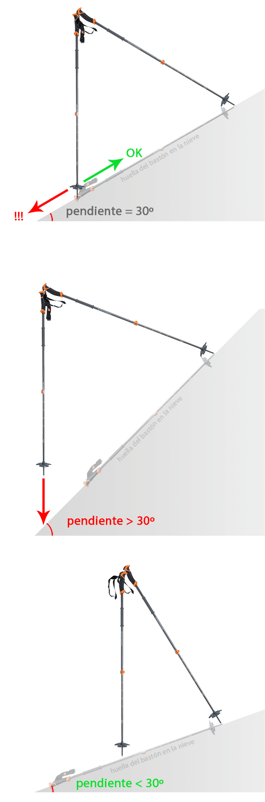

Si estamos metidos en el mundillo del esquí de travesía, ya deberíamos estar familiarizados con los partes de riesgo de avalanchas y conocer la importancia de una pendiente concreta: 30º.

Muy a menudo nos interesa saber si una ladera tiene una inclinación de más o menos de 30º, para determinar el nivel de seguridad. Hay varios métodos para comprobar la misma, pero yo os cuento aquí el que más me gusta. Puede realizarse sobre la marcha, en menos de 10seg:
<ol>
<li>Marcamos en la nieve la huella del bastón, perpendicular a la pendiente.</li>
<li>Ahora clavamos el primer bastón en el extremo superior de esta huella.</li>
<li>Sujetamos, colgando de la correa, el segundo bastón en el otro extremo (empuñadura) del primer bastón.</li>
<li>Ahora vamos bajando hasta que el bastón que cuelga toca en el suelo.</li>
<li>Si toca en el extremo inferior de la huella del bastón, la pendiente es de 30º. Si toca más arriba (Dentro de la huella) es de menos de 30º y si toca más abajo (Fuera de la huella) la pendiente será mayor de 30º.</li>
</ol>
Se entiende mucho mejor con unos dibujos:

Me ahorraré la demostración trigonométrica, que no creo que le interese a mucha gente en este blog... ;-)
