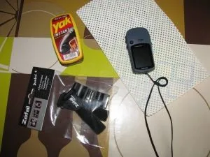
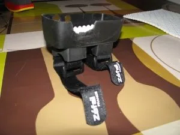
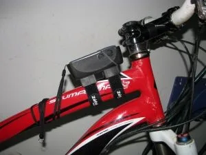
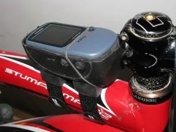

Hoy te vamos a mostrar lo sencillo y económico que es fabricarte tu propio dispositivo para llevar el gps en tus rutas de bici. En este caso, te enseñamos cómo hacerlo para un garmin eTrex, el gps que llevamos en SoloQuedaLoPeor...

En fin, manos a la obra:

1.- Lo primero de todo, vamos a ver la 'materia prima': necesitas un accesorio portabombas de la sección de ciclismo del Decathlon, y un limpiazapatos Yak (En los supermercados suele haber...)

2.- Cogemos la funda del limpiazapatos (La parte de espuma no nos interesa, pero puedes aprovechar para limpiar tus zapatillas) y le hacemos unas ranuras para adaptar los velcros del portabombas y unos recortes para poder accionar los botones del gps.

3.- Nosotros hemos añadido una capa de algún material amortiguador al fondo de la carcasa, para elevar un poco el gps, pero esto es opcional.

4.- Y ya está! Solo nos queda sujetar el gps alojado en la carcasa mediante un elástico y fijar el conjunto a la bici, ya sea en la potencia o en el cuadro. Podrás comprobar que el limpiazapatos Yak fue diseñado utlizando un Garmin eTrex como molde, jeje.

