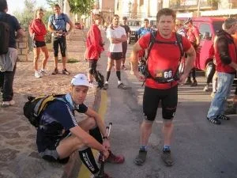
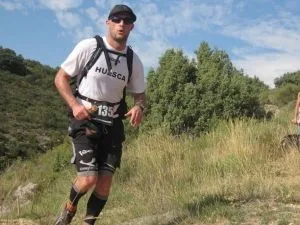
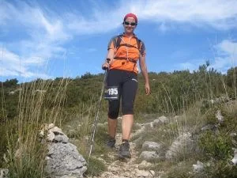
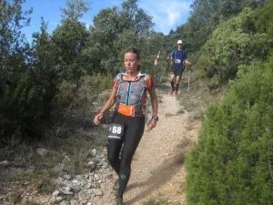
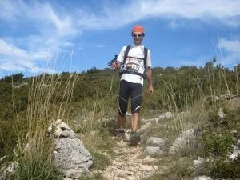
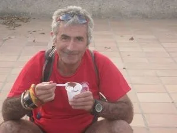

<table align="right" border="0" cellpadding="1"><tbody><tr><td>

</td></tr></tbody></table>

Pego a continuación un correo del globero Chus, referente a la brutalidad que han realizado varios globeros este pasado sábado:

<blockquote>Hola

Este fin de semana un nutrido grupo de globeros afrontó un gran reto: el Ultra Trail Guara Somontano.

Nada más y nada menos que 9 intrépidos (Marga, JR, Toño, Melet, Carlos Ciria, Latre, Javier Ara, Natalia y yo) se daban cita en la línea de salida con distintos objetivos, unos completar el recorrido, otros acabar entre los primeros, y otros como David acabando a tiempo de llegar a una fiesta el sábado noche en Huesca.

La dureza del terreno y el calor provocaron múltiples abandonos (casi un 40% de los corredores), pero todos los globeros lograron terminar, algunos en posiciones destacadas como en el caso de David Latre (6º) y Natalia (4ª). Además el trío Marga-Toño-Melet ganó en equipos mixtos.

Podéis ver información de la prueba en:

<a href="http://ultratrailguarasomontano.blogspot.com/" target="_blank">http://<wbr></wbr>ultratrailguarasomontano.<wbr></wbr>blogspot.com/</a>

Y como siempre, fotos y crónica en el blog de Monrasin:

<a href="http://monrasin.blogspot.com/2010/10/ultra-trail-guara-somontano.html" target="_blank">http://monrasin.blogspot.com/<wbr></wbr>2010/10/ultra-trail-guara-<wbr></wbr>somontano.html</a>

Saludicos

Chus</blockquote>Sin duda con cosas así uno se siente orgulloso de pertenecer al clan de los globeros...

A destacar el 6º puesto del doctor LaTrek, un globero consagrado del ultrafondo en raids y btt, ahora también en las carreras a pie.

<table align="center" cellpadding="0" cellspacing="0" style="margin-left: auto; margin-right: auto; text-align: center;"><tbody><tr><td style="text-align: center;"></td></tr><tr><td style="text-align: center;">Gracias a Monrasin: corredor, fotógrafo, cronista, bloguero,...</td></tr></tbody></table>
