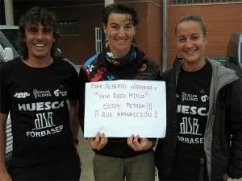

Ayer recibí un email del mítico equipo de raids de Peña Guara que estuvo en el Beloraid el pasado finde, formado por Carlos, César y Esmeralda.

Para mi sorpresa, me envían esta foto de César y Esme junto con <a href="http://www.emmaroca.net/" target="_blank">Emma Roca</a>, un mito viviente en todas las actividades que nos apasionan a los globeros. Sin duda merece estar en el blog globeril. Qué guay!!!
