¿Quién dijo que el esquí de montaña era un deporte minoritario?

[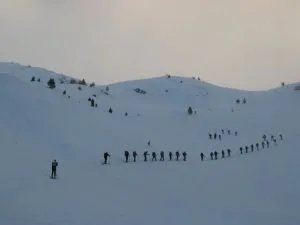](./assets/2009/02/IMG_0001.webp)

Nada más y nada menos que 35 personas del cursillo provincial organizado por <a href="http://www.p-guara.com/">Peña Guara</a>, foqueamos el domingo desde el refugio de La Renclusa al accesible pico Paderna. El tiempo, aunque empeorando a mediodía, se portó relativamente bien, y los cursillistas ¡chapó!, majo grupo se ha formado, sí señor, a pesar de algún revoltosillo infiltrado por ahí...

Más instantáneas

[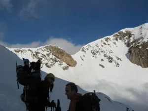](./assets/2009/02/IMG_0003.webp)[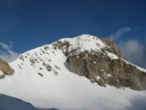](./assets/2009/02/IMG_0006.webp)

[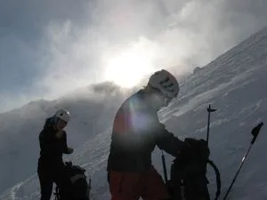](./assets/2009/02/IMG_0007.webp)[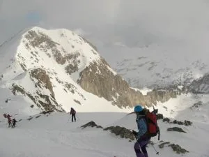](./assets/2009/02/IMG_0019.webp)[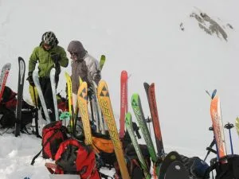](./assets/2009/02/IMG_0022.webp)[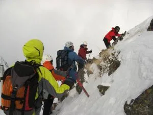](./assets/2009/02/IMG_0027.webp)[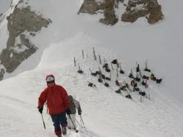](./assets/2009/02/IMG_0024.webp)[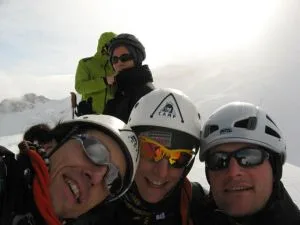](./assets/2009/02/IMG_0028.webp)[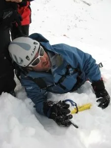](./assets/2009/02/IMG_0033.webp)[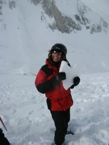](./assets/2009/02/IMG_0034.webp)
