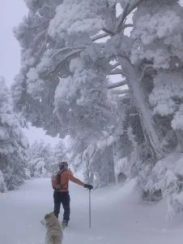

---
title: "Una nevada histórica... en imágenes"
publishDate: 2015-02-09T11:33:10Z
updateDate: 2015-02-09T11:49:43Z
draft: false
author: "AlbertoEpic"
excerpt: "Enero se despidió, y febrero nos recibió con una nevada histórica en toda la península, que ha dejado imágenes muy curiosas por todas partes. Desde aqui recogemos algunas fotos curiosas. No están todas las que son, pero si son todas las que"
category: "Otros"
tags:
  - "nevada histórica"
  - "Uncategorized"
  - "varios"
---
Enero se despidió, y febrero nos recibió con una nevada histórica en toda la península, que ha dejado imágenes muy curiosas por todas partes. Desde aqui recogemos algunas fotos curiosas. No están todas las que son, pero si son todas las que están. SQLP se congratula, esta nevada nos deja unas excelentes condiciones de nieve para todo el invierno... :-)

