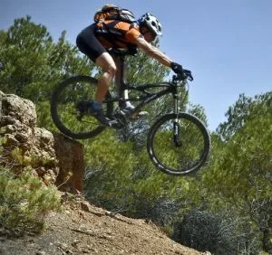

Hola globeros!

Os pego a continuación una aportación de José Orte:

<blockquote>Todo está en dejarse llevar, hay sitios insospechados ahí afuera… Utah está a una hora en coche de Zaragoza, y tener esta precaria libertad de horarios te da la oportunidad de dejarte arrastrar entre semana a sitios así. Sin domingueros, sin prisas… Además del paisaje, que de por sí ya merece la pena… están esas sendas sin demasiada pendiente, sin apenas dificultades técnicas… en las que te puedes dejar llevar plácidamente… o apretar para acelerarte y ver pasar los kilómetros sin un gramo de monotonía… Espero que os gusten:

<a href="https://picasaweb.google.com/josorte/CalatayudUtah?authkey=Gv1sRgCJ2b1cLXrMf_9gE" style="color: #406480;" target="_blank">https://picasaweb.google.com/<wbr></wbr>josorte/CalatayudUtah?authkey=<wbr></wbr>Gv1sRgCJ2b1cLXrMf_9gE#</a> </blockquote>
