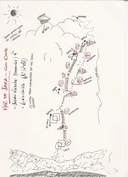

El pasado domingo estuvimos en la vía del Diedro de Hoz de Jaca. Nos habían hablado tanto de la dificultad oculta de los quintos de allí, que una vez en harina la cosa resultó más sencilla de lo esperado.

Por supuesto, la vía fue liberada en un limpio y digno estilo de A0 a vista en algún punto aislado...

Apuntar, para los que recuerden los seguros alejados, que la vía se encuentra reequipada y sólo hacen falta cintas, ni friends ni nada similar.

Como todavía me encuentro en fase de adiestramiento con la cámara gopro, las imágenes dejan bastante que desear. Disculpas desde la productora.

Según la reseña, y con cuerdas de 70m, hicimos lo siguiente:

<ul><li>Rapelamos rápel 1, rápel 2 y rápel 4</li><li>Salimos del suelo, un largo hasta R1, otro hasta R2, y enlazamos R3-R4-R5 en uno solo, porque el sol estaba cerca y teníamos cada vez más hambre...</li></ul>
Puedes ver el video del evento a continuación:

<iframe width="560" height="315" src="https://www.youtube.com/embed/NLOmOd6jbFQ" title="YouTube video" frameborder="0" allow="accelerometer; autoplay; clipboard-write; encrypted-media; gyroscope; picture-in-picture" allowfullscreen></iframe>

