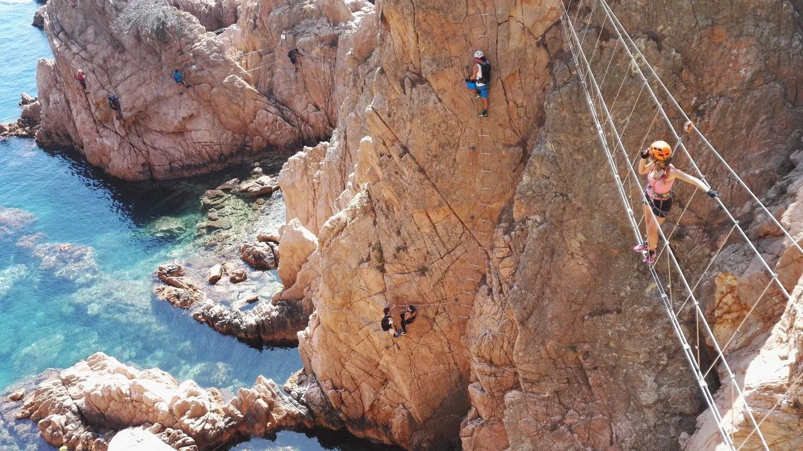

El otro día, AlbertoEpic estuvo conociendo por fin esta curiosa vía ferrata. Muy chula y original, desde luego un aliciente perfecto para los que no les gusta demasiado la playa...

El único 'pero' es la masificación: acostumbrados a movernos en la soledad de la montaña, de repente aquí estamos en un 'parque temático'! Recomendable hacerla entre semana y fuera de temporada, o a horas 'extrañas'. Al hacerla en fin de semana y por la mañana, aquello fue una romería...

 Comenzando la segunda mitad de la ferrata, la cosa va más fluída...

Por fortuna, a mitad de vía hay un escape por el que casi la mitad de los intrépidos que comienzan aprovecha para batirse en retirada, y la segunda mitad de la ferrata la cosa va algo más fluída.

Aparte de la masificación, la verdad es que la ferrata merece la pena, aunque sólo sea por curiosidad, para hacerla al menos una vez.

Puedes consultar el <a href="http://www.gpsies.com/map.do?fileId=lxbfpheieieoayrs" target="_blank">track aquí</a>.
