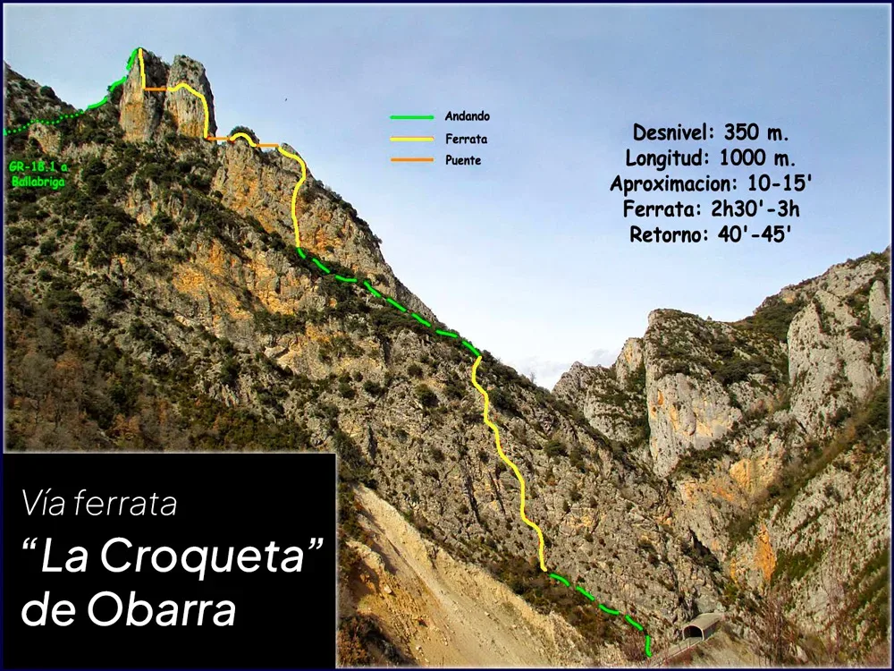
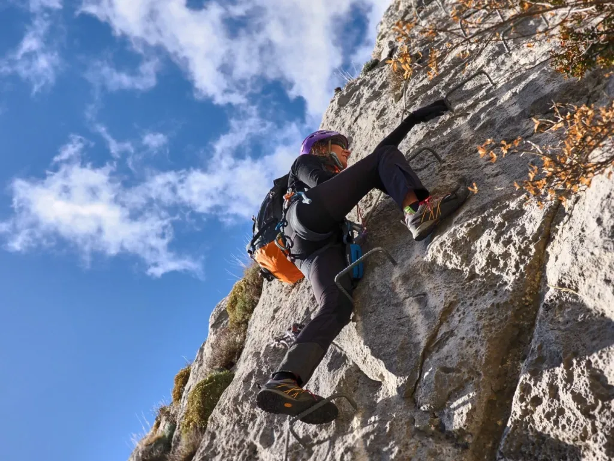
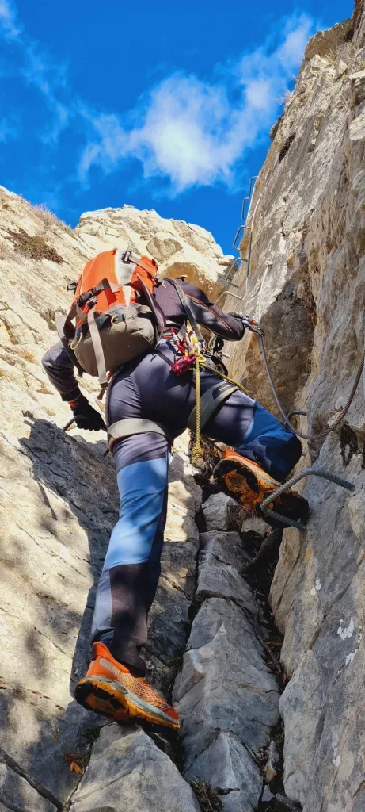

## Una ferrata larga y mantenida...

El pasado 11 de enero, y para comenzar sus actividades del 2024 por todo lo alto, el equipo SQLP TeRReXtrem formado por los especialistas July y AlbertoEpic decide ir a recorrer la vía ferrata de 'La Croqueta" de Obarra. Durante largo tiempo en la lista de 'pendientes', la escasez de nieve este invierno y las inusualmente altas temperaturas provocaron que esta ferrata fuera un plan razonable para estas fechas.

Arriba puedes ver un croquis de la vía., y abajo verás el track sobre el mapa.

<iframe class="alltrails" src="https://www.alltrails.com/es/widget/map/map-247d87b-6?scrollZoom=false&u=m&sh=w4k06q" width="100%" height="400" frameborder="0" scrolling="no" marginheight="0" marginwidth="0" title="AllTrails: Trail Guides and Maps for Hiking, Camping, and Running"></iframe>

Puedes leer más información en <strong><a href="https://deandar.com/ferratas/via-ferrata-obarra-croqueta" target="_blank" rel="noreferrer noopener">este enlace externo</a></strong>. A destacar que es una ferrata excelentemente equipada y mantenida. Todas la rocas susceptibles de soltarse y caer están bien pegadas con sika. Las grapas todas colocadas en su posición lógica, ninguna 'a contrapié' nos obligará a hacer malabares.

El primer tramo es bastante sencillo. Luego llega una parte de progresar por una terraza hacia la izquierda (Escape a la derecha) y enseguida empieza el meollo de la cuestión. Una ferrata muy vertical y mantenida, con varios puentes y buitres sobrevolándonos, que hará las delicias de cualquier individuo 'con gustos raros', diferentes a los clásicos 'furgol' o 'sillonbol'...

Por cierto, si vas a hacer la ferrata, desde SQLP te aconsejamos que desestimes la idea de hacer un tramo y regresar por algún escape. En esta ferrata, la mejor salida siempre es hacia adelante! Regresar por un escape es mucho más arriesgado. Escarpado y lleno de piedra suelta. Mejor apretar un poco más de brazos enganchado a una línea de vida que despeñarte sin remisión por una sucia terraza...

Te dejamos a continuación con un par de fotos de nuestros especialistas:

