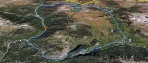

El pasado sábado,  Nacho, Jose y Alberto se fueron a dar un rulo por el Pirineo con las btt. El itinerario escogido fue Salinas - Bielsa - Parzán - Ordiceto - GR11 hacia Viadós - Plan - Salinas.

Una ruta todosubida-todobajada... Para calentar, 3h de subida hasta el GR11 de bajada, que hicieron recordar a AlbertoEpic la importancia de los entrenamientos en esto de la bici...

Sigo estudiando el tema de la edición  y compresión de video, pero la cosa va lenta. Aqui va el cutre-video:

https://blip.tv/play/AYGZqRwC
</embed> 

