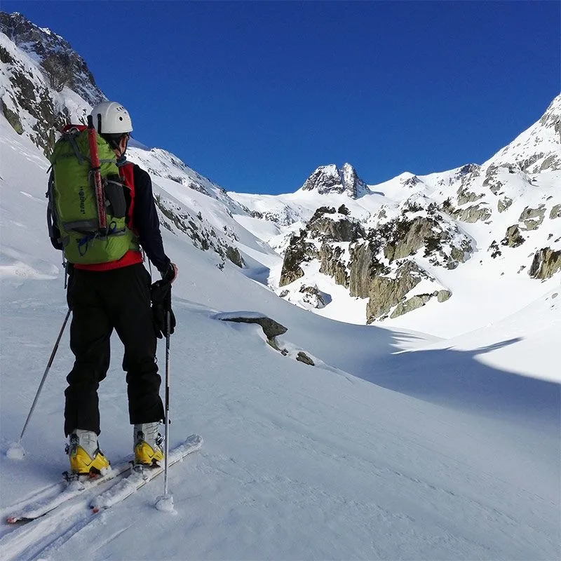
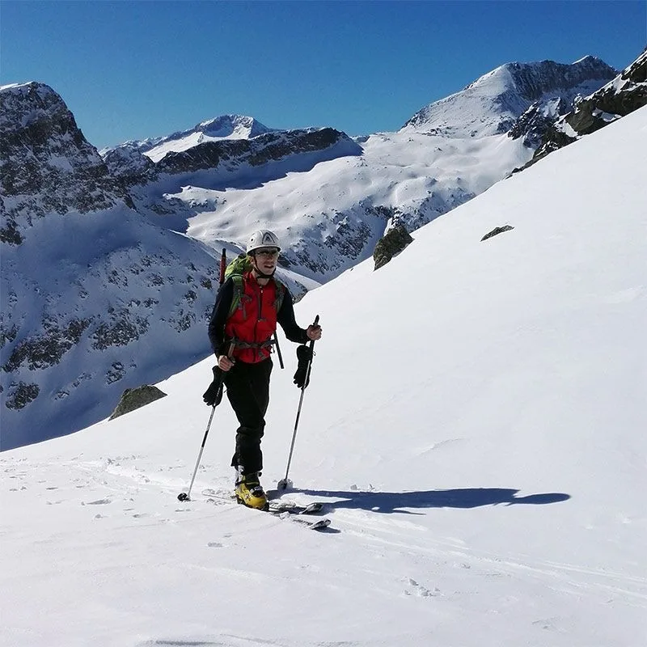
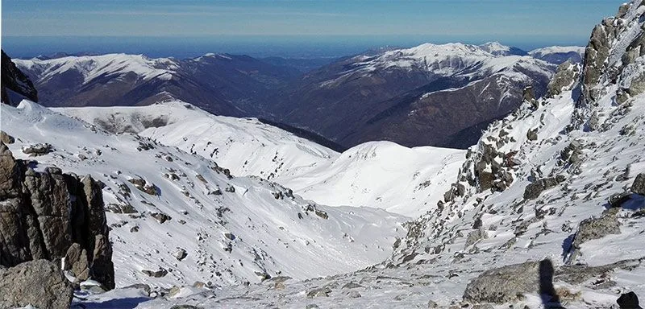
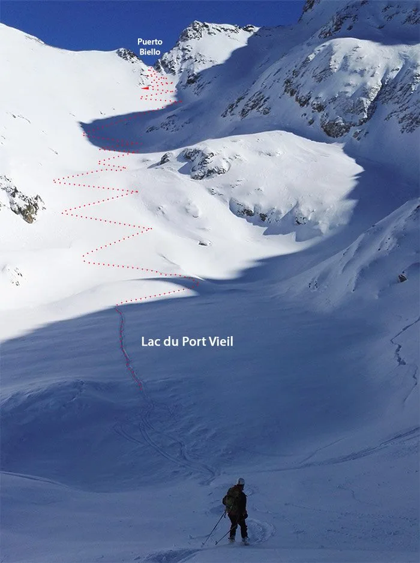
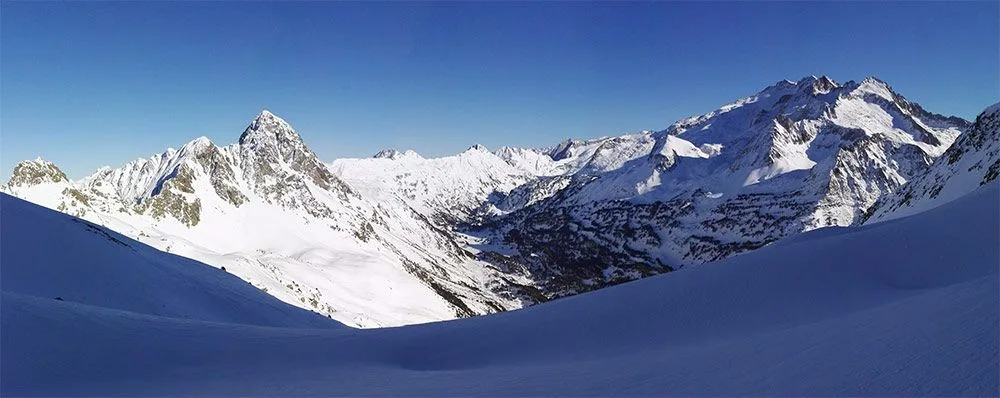

El pasado finde, los globeros jR&Marga&Alejandra y AlbertoEpic&Luzia&Sami&Tai estuvieron concentrados en Benasque para aprovechar las últimas nevadas.

Se recurrió a la afamada técnica 'turno de padres'/'turno de madres' para alternar actividades deportivas con actividades de guardería.

El sábado, jR y AlbertoEpic decidieron aventurarse a conocer terreno desconocido, y se lanzaron a hacer una propuesta de Jorge (LaMeteoQueViene): '<a href="http://lameteoqueviene.blogspot.com.es/2016/02/circular-al-mall-pintrat-benasque-6-feb.html" target="_blank">circular al Mall Pintrat</a>'.

Puedes consultar aquí el track de la ruta:

<iframe src="http://www.gpsies.com/mapOnly.do?fileId=rzuffbymntyjnlkl" width="100%" height="500" frameborder="0" marginwidth="0" marginheight="0" scrolling="no"></iframe>

Respecto al track, sólo un apunte: la parte que discurre por el fondo del valle de Remuñe, debido a la mala recepción de la señal gps, el track está editado y es sólo orientativo.

Y a continuación, algunas fotos:

jR subiendo por el valle de Remuñe, por la margen derecha. Al ser el primer día de calor después de las nevadas, había que olvidarse de una huella que iba por la cara S. Todas las paredes de la margen izquierda del valle de Remuñe (Cara S) estaban cargadas de nieve y hielo, que con el sol de la mañana se iba derritiendo y cayendo. Al fondo, cierra el valle la Forca de Remuñe.

jR llegando al cuello de Mall Plané. La nieve estaba bien, y se ha podido subir desde abajo con los esquís puestos. Al fondo, encima de jR, el Posets, y más a la derecha asoma el Perdiguero.

La vista desde el collado hacia Francia. Bagneres de Luchon. Los primeros 4 ó 5 metros de bajada la nieve está barrida por el viento, pero luego ya se calzan esquís y emprenden un fantabuloso descenso por 'polvorón del güeno' hasta el Lac du Port Vieil.

En la foto puede verse el final de la bajada hasta el lago, donde toca transición y un breve foqueo (La huella está resaltada) hasta el Puerto Biello.

Aquí sí, jR y AlbertoEpic agradecen enormemente la labor del anónimo grupo que abrió la huella de ascenso hasta el collado. Lo que fuera una dura labor para ese grupo, resultó un juego de niños para ellos, siguiendo una huella perfecta. :-)

Y este es el panorama desde el Puerto Biello, mirando hacia España. A la izquierda destaca el pico Salvaguardia, y a la derecha el macizo de las Maladetas.

Ya sólo quedaba el descenso hasta los Llanos del Hospital. La primera parte, nuevamente nieve polvo de vicio. Luego, algo de costra de rehielo finita, que 'haciendo un poco el burro' no afectaba al esquí, y para terminar, sopa.
La ausencia de base obligó a descalzarse los esquís y bajar andando por el bosque hasta salir a los Llanos del Hospital. Personalmente, habría preferido salir desde el final de la carretera, pero al llegar esa mañana, una barrera impedía el paso a la altura del desvío al Hospital de Benasque, y nos hizo bajar a los Llanos. Aparte de eso, sin duda una ruta de cinco estrellas!!!
