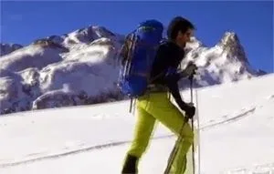

Hacemos un 'flashback' para retroceder al pasado (reciente) y ver un video filmado y editado por la componente del Equipo SoloQuedaLoPeor, Luzia:

el pasado 22 de diciembre, día de la lotería, a algunos les tocó un fantástico día de esquí de travesía por la zona del pico Peyreget.

Esperamos que os guste.

<iframe allowfullscreen="" frameborder="0" height="370" src="https://www.youtube.com/embed/ZNGDJsT-wUs" width="657"></iframe>

