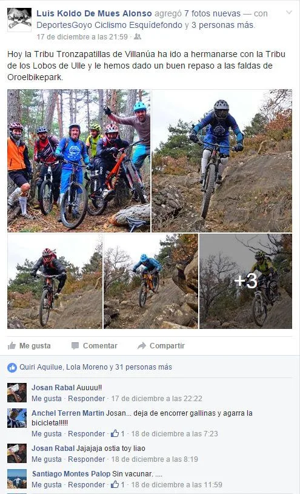
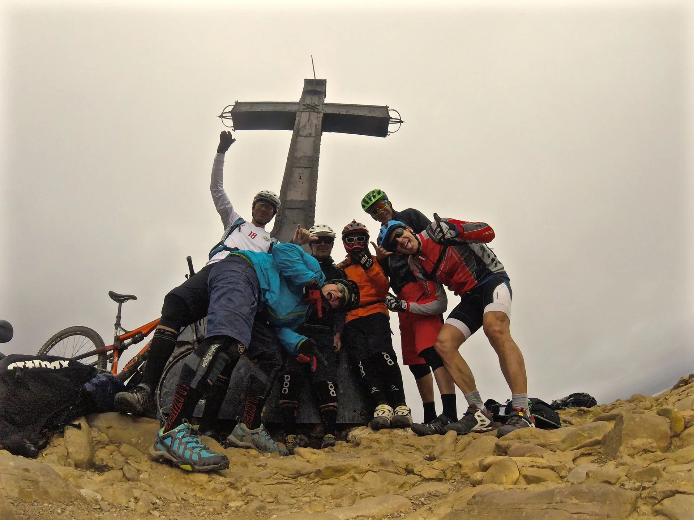
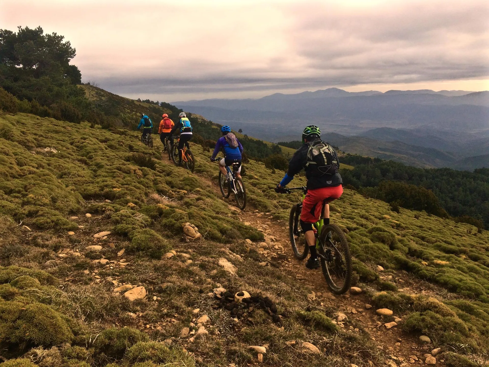
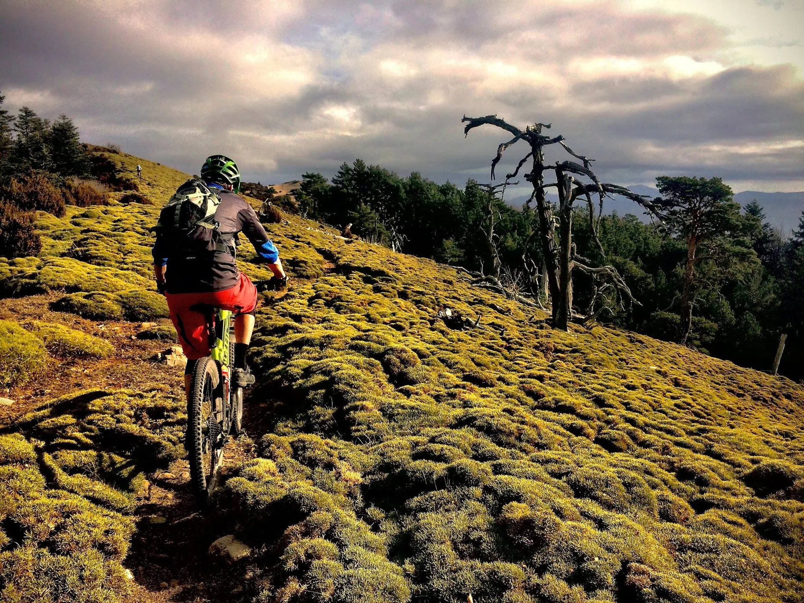
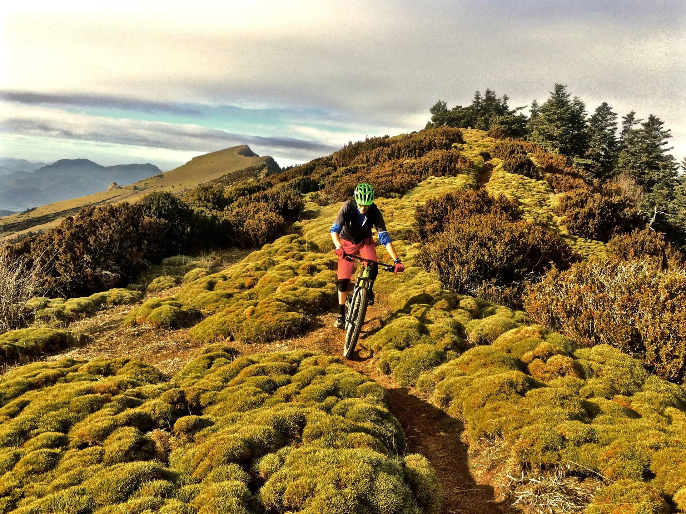

El otro día, de buenas a primeras se formó un buen grupeto de seres singulares que, con la bici y el enduro como nexo de unión, y alentados por un post incendiario en Facebook de Koldo (EnduroMaster de la Jacetania), acudieron a Jaca como moscas a la miel...

La ruta elegida era la vuelta a Peña Oroel, pero aderezada con mucho sendero y grandes dosis de adrenalina... Como novedad, la parte baja del sendero de Los Lobos, con una nueva variante, como dicen los entendidos, 'con mucho flow'! Y de postre, para terminar la ruta, la bajada de Las Calzadas, todo un clásico. Al final de la ruta, los seis integrantes (Quiri, Pedro, Oscar, Javi, Paco y AlbertoEpic) de la grupeta terminaron mansos, mansos... y con una sonrisa de oreja a oreja. :-)

A destacar que Pedro celebraba su cumpleaños ese día, y no dudó en traernos unos buñuelos y descorchar una botella al finalizar la ruta.

Ya que en Producciones Soloquedalopeor vamos muy mal de tiempo para editar videos como antaño, hemos pensado recurrir temporalmente a una novedosa idea: aportaremos audios de la ruta, donde dejar testimonio de los momentos vividos durante la jornada. Se trata de una idea recién nacida en nuestra factoría, y todavía precisa de desarrollo y perfeccionamiento, pero ahí va el primer audio: se trata del ambiente reinante junto a las furgonetas al terminar la ruta.
<iframe src="https://w.soundcloud.com/player/?url=https%3A//api.soundcloud.com/tracks/238403207&auto_play=false&hide_related=false&show_comments=true&show_user=true&show_reposts=false&visual=true" width="100%" height="450" frameborder="no" scrolling="no"></iframe>

Puedes ver el mapa con el track de la ruta a continuación (El track ha sido postprocesado, para evitar algún pequeño error de cobertura del track original de Koldo y eliminar una pequeña 'variante imaginativa' que necesitaba un poco de desbroce...)

<iframe src="http://www.gpsies.com/mapOnly.do?fileId=ekfkufcinrmlmwzh" width="100%" height="500" frameborder="0" marginwidth="0" marginheight="0" scrolling="no"></iframe>

Y a continuación verás algunas fotos de la ruta, todas cortesía de Quiri.

 Foto de grupo en la cima.

 Hacia los árboles de Mordor...

 Peña Oroel al fondo, recorriendo todo el cordal.
