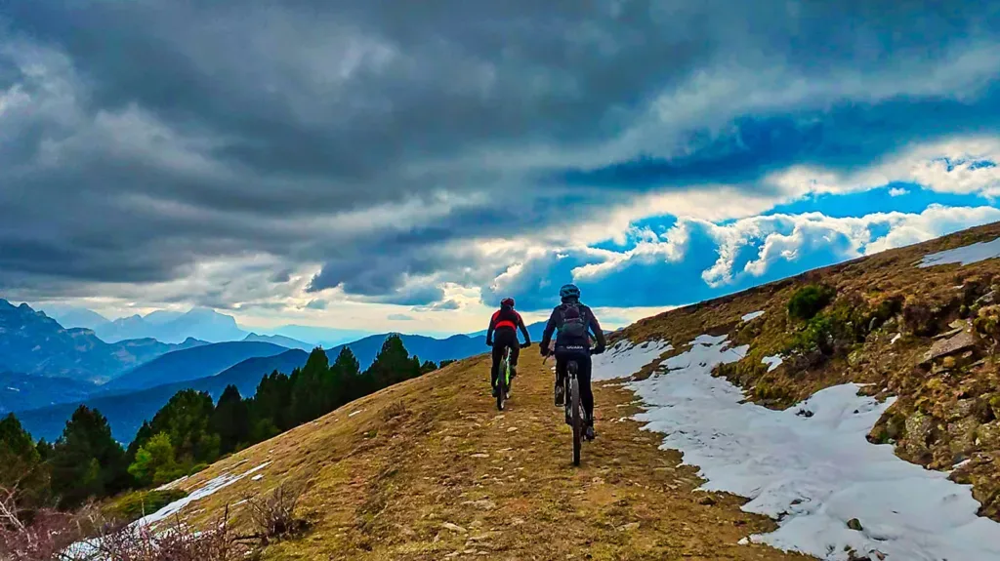
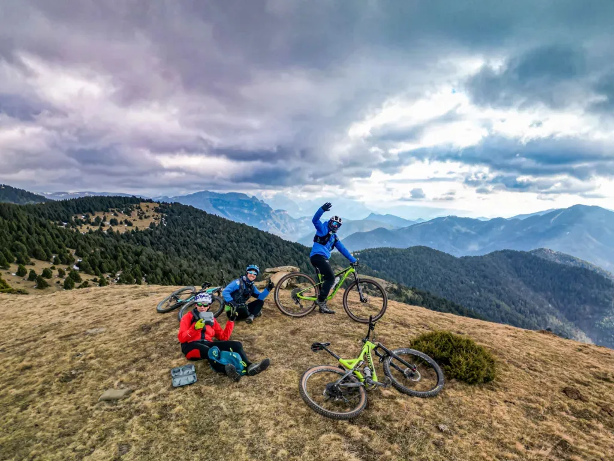
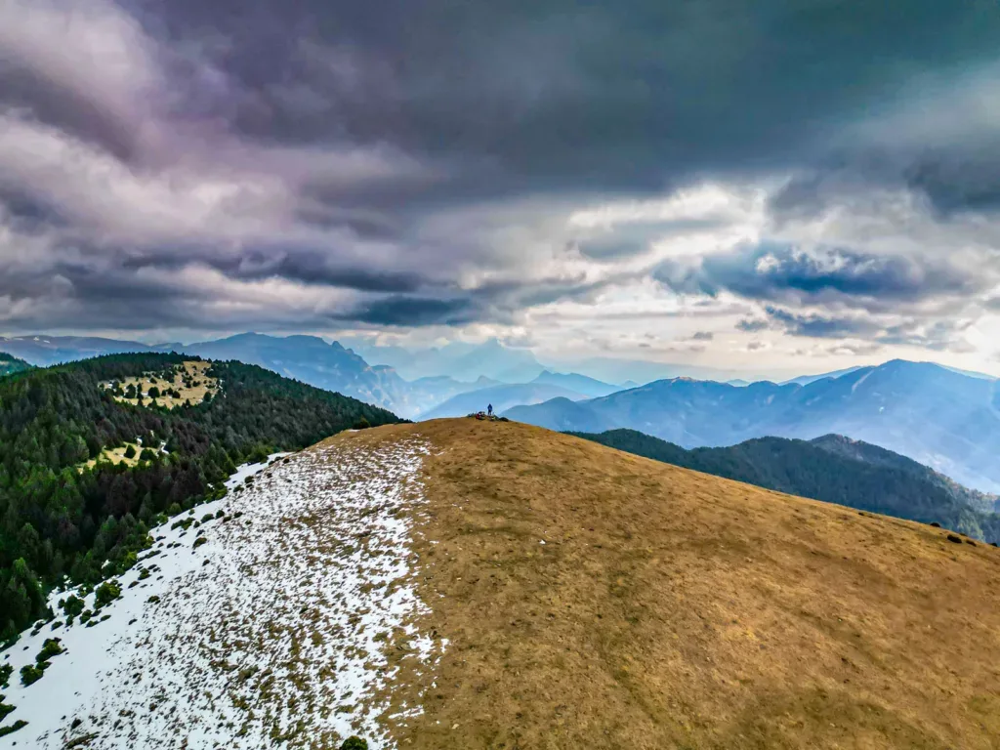

## A falta de nieve... Buenos son los piñones!

A mediados de enero, la nieve todavía escasea en el Pirineo. Nuestro especialista AlbertoEpic, cansado de mirar al cielo y los termómetros, decide cambiar el chip y estudiar los mapas para encontrar un enclave chulo donde volar el dron esté permitido para conseguir unas imágenes de calidad.

En esta ocasión le toca el turno al cordal de la Sierra de las Mentiras. Limítrofe con el Parque Nacional de Ordesa, promete una vistas impresionantes de sus tresmiles nevados. 'Casualmente', la <a href="https://zonazeropirineos.com/rutabtt/zz-040-el-sarrau-del-tuerto/" target="_blank" rel="noreferrer noopener">ruta ZZ-040 El Sarrau del Tuerto</a> pasa por allí. Decidido pues, la actividad será en BTT, la ruta será la ZZ-040, y ¿los especialistas? Hoy en día con los grupos de Whatsapp es muy fácil! Enseguida se unen al plan dos mákinas de absoluta confianza: Jorgito y Dani.

A petición de AlbertoEpic, deciden hacer la ruta desde Buesa, en lugar de Broto, para contar con algo de tiempo extra para volar el dron. Tienes a continuación el track con la ruta realizada:

<iframe class="alltrails" src="https://www.alltrails.com/es/widget/map/sarrau-del-tuerto-desde-buesa-st-65f2a94?scrollZoom=false&u=m&sh=w4k06q" width="100%" height="400" frameborder="0" scrolling="no" marginheight="0" marginwidth="0" title="AllTrails: Trail Guides and Maps for Hiking, Camping, and Running"></iframe>

Desgraciadamente, la predicción de la meteo falló y el frente se adelantó, de manera que no tuvieron visibilidad hacia los tresmiles de Ordesa... Gran excusa para volver! Nuestros especialistas terminaron la ruta en medio de una discreta nevada.

Y tras mucho dudarlo, sacaron el dron para unas breves imágenes de la parte alta de la ruta. Después de cargarlo toda la subida... era tontería no sacarlo!

<figure class="wp-block-embed is-type-video is-provider-youtube wp-block-embed-youtube wp-embed-aspect-16-9 wp-has-aspect-ratio">

<iframe width="560" height="315" src="https://www.youtube.com/embed/QR0JJjAPpDI" title="YouTube video" frameborder="0" allow="accelerometer; autoplay; clipboard-write; encrypted-media; gyroscope; picture-in-picture" allowfullscreen></iframe>

</figure>

Y después del 'short' de Youtube, te mostramos alguna foto de la ruta:

*Dani y Jorge en la parte alta de la ruta. Un día totalmente despejado a la salida se estaba nublando...*

*Los tres especialistas en la cima de la Punta Sarrulla.*

*La Punta Sarrulla desde el aire... Con un cielo cada vez más negro, y la temperatura cayendo en picado!*
